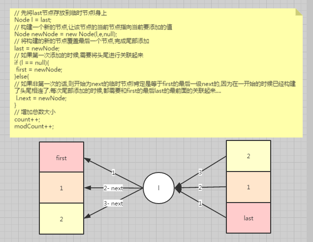

# LinkedList

## linkedList的数据结构

### 数据结构

- Node
  - E e 存储对象
  - prev 前节点
  - next 后节点
- Node first; // 头部节点
- Node last; // 尾部节点
- int count; // 当前链表大小
- int modSize;// 改动大小

### 简单实现一个链表挂在尾部

```java
public void add(E e){
  // 构建一个新的节点,并且将它的next设置为null;
  Node newNode = new Node(e,null);	 
  last = newNode;
}
```


### 实现一个头尾相连的双向链表

```java

public void linkLast(E e){
  // 构建一个临时节点保存last的副本
  Node l = last;
  // 重新构建一个新的节点和当前对象进行绑定,并且将它的上级节点设置成last的值,下级为null.
  Node newNode = new Node(l,e,null);
  // 将last的节点设置设置为新的节点
  last = newNode
  // 这里需要判断临时last节点是否为null,如果是null说明是第一个插入的节点.这里需要将这个节点头尾进行关联起来,这里first和last指向的是同一个引用
  if(l == null){
   first = newNode; 
  }else{
  // 这里需要多多思考一下,是如何利用引用达到头尾相连的.
    //1. 能够进入到这里的说明肯定不是第一次插入了
    //2. 假设这是第二次插入
    //2.1 因为第一步已经进行头尾关联了,所以这里的l肯定就是等于first,他们在堆中是一个引用
    //2.2 l.next 等价于 first.next [这里仅仅是第二步哟]
    //3. 假设这是第三次插入
    //3.1 Node l = last ; 说明这次last是等于最后一次插入的对象的,最后的节点嘛
    //3.2 由于第一次的时候已经进行了头尾相连,第二次也用到了引用[l == last == first.next]
    //3.3 所以依次类推.last最前面的值,肯定等于first最后面的值.所以last==first.next....next
    // 所以尾部只要增加了.临时节点l.next=newNode 就相当于头部最后也增加了,因为last的引用就是指向first.lastNext的引用嘛,真正的头尾相连
    l.next = newNode
  }
  // 这里就是需要将计数的值进行累加
  count++;
  modSize++;
}
```

