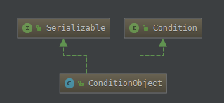
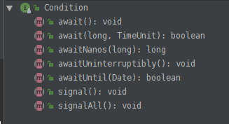

# Condition

## 数据结构

1. ConditionObject



2. Condition



3. 存储媒介

   ```java
   // 类似于一个双向链表
   /** First node of condition queue. */
   private transient Node firstWaiter;
   /** Last node of condition queue. */
   private transient Node lastWaiter;

   ```

4. node的结构

   ```java
   static final class Node {
     /** Marker to indicate a node is waiting in shared mode */
     // 标识节点当前在共享模式下
     static final Node SHARED = new Node();
     /** Marker to indicate a node is waiting in exclusive mode */
     // 标识节点当前在独占模式下
     static final Node EXCLUSIVE = null;

     // ======== 下面的几个int常量是给waitStatus用的 ===========
     /** waitStatus value to indicate thread has cancelled */
     // 代表此线程取消了争抢这个锁
     static final int CANCELLED =  1;
     /** waitStatus value to indicate successor's thread needs unparking */
     // 官方的描述是，其表示当前node的后继节点对应的线程需要被唤醒
     static final int SIGNAL    = -1;
     /** waitStatus value to indicate thread is waiting on condition */
     // 表示线程处于等待的条件下的值，与下面的waitStatus对应，这在Lock中的condition中会使用
     static final int CONDITION = -2;
     /**
      * waitStatus value to indicate the next acquireShared should
      * unconditionally propagate
      */
     static final int PROPAGATE = -3;
     // =====================================================

     // 取值为上面的1、-1、-2、-3，或者0(以后会讲到)
     // 这么理解，暂时只需要知道如果这个值 大于0 代表此线程取消了等待，
     // 也许就是说半天抢不到锁，不抢了，ReentrantLock是可以指定timeouot的。。。
     volatile int waitStatus;
     // 前驱节点的引用
     volatile Node prev;
     // 后继节点的引用
     volatile Node next;
     // 这个就是线程本尊
     volatile Thread thread;
   }
   ```

   ​

## 主要方法解读

1. 阻塞等待的方法

```java
  public final void await() throws InterruptedException {
      // 1.1 如果线程中断,则直接抛出异常
      if (Thread.interrupted())
          throw new InterruptedException();
      // 1.2 构建一个新的节点加入到链表的尾部并且返回出来
      Node node = addConditionWaiter();
      // 1.3 释放掉当前线程抢占的锁
      int savedState = fullyRelease(node);
      int interruptMode = 0;
      // 1.4 是否是同步队列中的节点
      while (!isOnSyncQueue(node)) {
          LockSupport.park(this);
          if ((interruptMode = checkInterruptWhileWaiting(node)) != 0)
              break;
      }
      
      if (acquireQueued(node, savedState) && interruptMode != THROW_IE)
          interruptMode = REINTERRUPT;
      if (node.nextWaiter != null) // clean up if cancelled
          unlinkCancelledWaiters();
      if (interruptMode != 0)
          reportInterruptAfterWait(interruptMode);
  }
```

- `addConditionWaiter`: 将当前线程加入到等待队列中  

```java

private Node addConditionWaiter() {
  	// 获取最后一个等待队列节点
    Node t = lastWaiter;
    // If lastWaiter is cancelled, clean out.
  	// 如果这个等待队列中的节点不是CONDITION状态,则取消该状态
    if (t != null && t.waitStatus != Node.CONDITION) {
      unlinkCancelledWaiters();
      t = lastWaiter;
    }
    Node node = new Node(Thread.currentThread(), Node.CONDITION);
    if (t == null)
      firstWaiter = node;
    else
      t.nextWaiter = node;
    lastWaiter = node;
    return node;
  }
```

- `unlinkCancelledWaiters`:检测队列中是否存在已经取消的节点,将它清除掉  

```java

private void unlinkCancelledWaiters() {
  	// 找到第一个节点
    Node t = firstWaiter;
    // 这里将构建一个有效的节点链表
    Node trail = null;
  	// 从第一个节点开始往下遍历
    while (t != null) {
      //拿到next节点
      Node next = t.nextWaiter;
      // 如果不是CONDITION状态
      if (t.waitStatus != Node.CONDITION) {
        // 移除掉该节点	
        t.nextWaiter = null;
        // 一开始肯定是null的
        if (trail == null)
          firstWaiter = next; // 将next设置为firstWaiter,为了下一次循环再找下一个节点
        else
          trail.nextWaiter = next;// 如果这个有值的情况下,存在有效节点
        if (next == null)
          lastWaiter = trail;// 如果已经是null了说明已经是最后一个节点了
      }
      else // 这里说明都是有效的节点,符合CONDITION
        trail = t;// 
      t = next;
    }
  }
```

**流程梳理**:

1. 检查当前线程的中断标志,如果为true,则抛出异常
2. 将当前线程构建成一个节点放入等待队列中,并且顺手清理掉已经取消掉的无用节点
3. 释放掉当前的独占锁
4. 然后是一个while循环，这个循环会循环检测线程的状态，直到线程被signal或者中断唤醒**且**被放入Sync锁等待队列。如果中断发生的话，还需要调用checkInterruptWhileWaiting方法，根据中断发生的时机确定后去处理这次中断的方式，如果发生中断，退出while循环。
5. ​