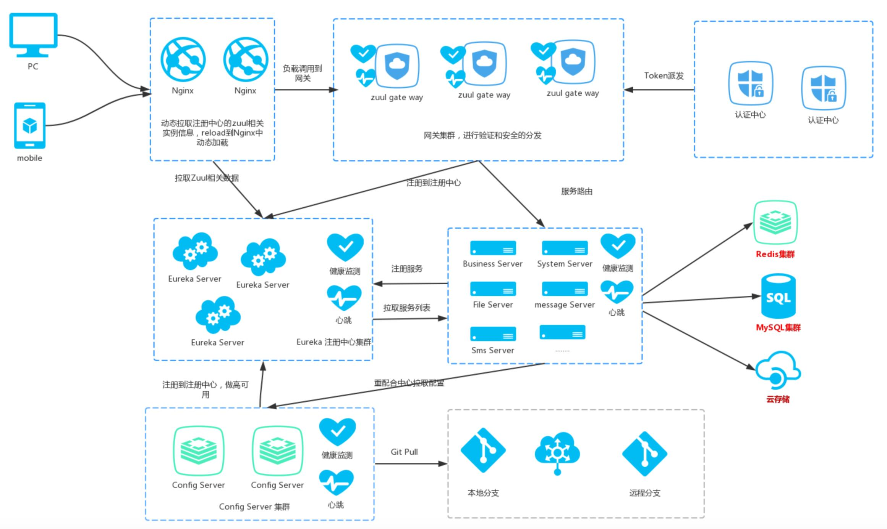
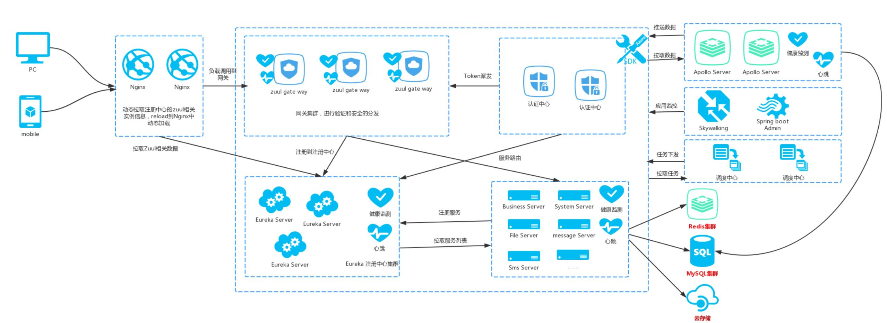

# 微服务落地

## 为什么要用微服务

1. 代码量增加

业务增长导致代码量增多。

2. 维护负担

代码量以及开发人员的能力也会使得这个系统变得更加复杂

3. 拓展困难

可能更改一个功能，牵扯到上下游的服务。

4. 风险增加

测试难度大，难回归，上线风险高。

## 遇到的挑战

1. 实例数量增多，如何管理？

线上微服务的数量可能为成百上千，需要从哪些维度来管理服务，需要提供哪些对微服务服务的操作？微服务管理如何满足企业对应用生命周期管理的规范和流程？

2. 如何监控这么多的服务运行情况?

为了更好掌控业务/应用/微服务的状态，需要监控哪些指标？如何存储？如何聚合？如何分析？如何展示?

3. 需要哪些通用组件?

微服务架构体系除了业务服务本身，还需要基础组件的支撑，目前有多开源组件可供选择，但各个开源组件或多或少在应用中会遇到一些挑战，如何选择开源组件以及如何解决遇到的挑战？

## 特点

1. 高效、快速响应

服务持续演进，快速、低成本拆分模块。

2. bug少、快速上线

每个微服务独立部署，不再需要协调其他服务部署对本地的影响。

3. 隔离性

每个服务独立运行，与其他服务互不干扰。

4. 伸缩性

每个服务无状态，可以根据每个服务来部署满足需求的规模。

5. 高内聚、低耦合

每个服务只关注一件事情。

## 微服务平台功能

### API网关

1. #### 流量统计

- 活跃的API
- 耗时的API
- 历史数据
- 错误状态分布
- 错误列表

1. #### 高频定位

2. 

3. #### 耗时排序

4. #### 超时保护

5. #### 日志管理

6. #### 缓存管理

7. #### 服务端限流

- 限流
- 配额

1. #### 安全校验

- 密钥
- 密码
- 第三方

#### 路由策略

1. 权重

2. IP

3. 服务发现

4. HEADER

5. #### 跨域管理

### 服务管理

#### 1. 元数据管理

2. 服务分组
3. 灰度发布
4. 回滚
5. AB测试

### 监控

1. 健康检查

2. metrics 监控

3. 服务拓扑

4. 性能监控

5. 链路梳理

6. 错误定位

7. 服务告警

   

### 架构图

#### 初版

#### 改进版

