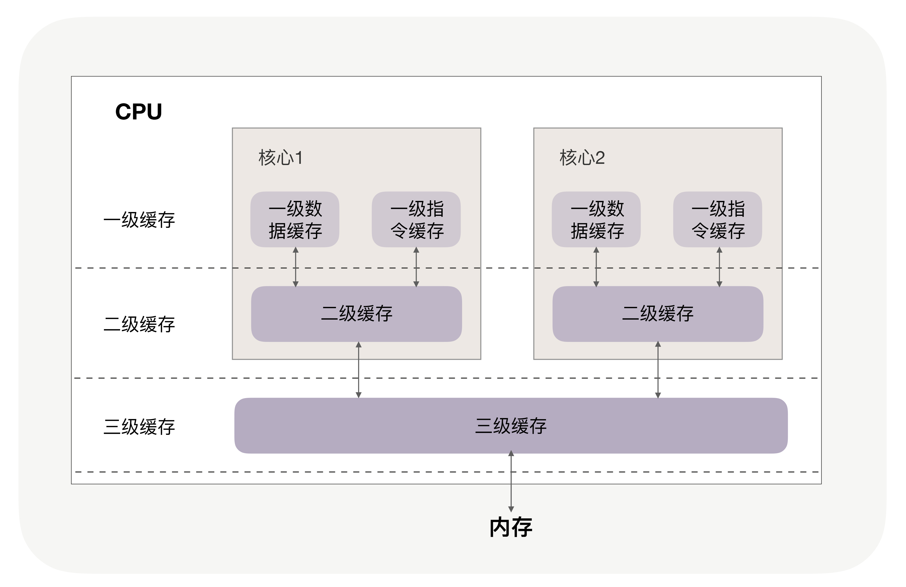

# 系统性能调优笔记

## CPU缓存

### 1. 怎样写代码会让CPU执行的更快



#### 1.1 提升CPU的缓存命中率

##### **1. 提升数据缓存的命中率**

```java
for(i = 0; i < N; i+=1) {
    for(j = 0; j < N; j+=1) {
        array[i][j] = 0; // 占用的内存是连续的，CPU能够根据下标读到下三个
        //array[i][j] = 0; // 占用内存是不连续的

    }
}
```

1. 为什么两者的执行时间有约 7、8 倍的差距呢？

> 其实这两个问题的答案都与 CPU Cache Line 相关，它定义了缓存一次载入数据的大小，Linux 上你可以通过 coherency_line_size 配置查看它，通常是 64 字节。

```shell
cat /sys/devices/system/cpu/cpu0/cache/index1/coherency_line_size 
64
```

因此测试服务器第一次会载入64字节至缓冲中。

当载入array[0[0]时，**若他们占用的内存不足64字节，CPU就会顺序的补足后续元素。**

顺序访问array【i】【j】就是利用了这一特点,所以就会比array【j】【i】要快，也正因为这样：**当元素类型是4个字节的整数时，性能就会比8个字节的高精度浮点数时速度更快,因为缓存一次性载入的元素会更多**

**为什么会相差8倍?**

因为win 64位操作系统的地址占用8个字节，32位是4个字节。

因此每批缓存行最多也就能载入不到8个二维数组元素，所以性能差距接近8倍。

**应用案例: Nginx**

通过hash表来存放域名、HTTP头部等数据的，这样访问速度非常快,而哈希表里的桶的大小如`server_names_hash_bucket_size` 他默认就等于CPU的缓存行的值由于存放的字符串长度不能大于桶的大小,所以当需要存放更长的字符串时，需要修改桶的大小，但Nginx官网上明确建议它应该都是缓存行的整数倍。这样就能保证读取的次数是充足并且合适的。


##### **2. 提升指令缓存的命中率**

```java
int array[N];for (i = 0; i < TESTN; i++) array[i] = rand() % 256;
// 3、4行代码执行顺序会影响性能
for(i = 0; i < N; i++) { if (array [i] < 128) array[i] = 0;}
sort(array, array +N);
```

**分支预测器**

​	当代码中出现 if、switch 等语句时，意味着此时至少可以选择跳转到两段不同的指令去执行。如果分支预测器可以预测接下来要在哪段代码执行（比如 if 还是 else 中的指令），就可以提前把这些指令放在缓存中，CPU 执行时就会很快。当数组中的元素完全随机时，分支预测器无法有效工作，**而当 array 数组有序时，分支预测器会动态地根据历史命中数据对未来进行预测，命中率就会非常高。**

​	究竟有多高呢？我们还是用 Linux 上的 perf 来做个验证。使用 -e 选项指明 branch-loads 事件和 branch-load-misses 事件，它们分别表示分支预测的次数，以及预测失败的次数。通过 L1-icache-load-misses 也能查看到一级缓存中指令的未命中情况。

##### 3. 提升多核CPU下的缓存命中率

每个线程绑定CPU去执行，避免上下文线程切换的时候，无法命中之前已经填充好的一二级缓存。

> 操作系统提供了将进程或者线程绑定到某一颗 CPU 上运行的能力。如 Linux 上提供了 sched_setaffinity 方法实现这一功能，其他操作系统也有类似功能的 API 可用。我在 GitHub 上提供了一个示例程序（代码见这里），你可以看到，当多线程同时执行密集计算，且 CPU 缓存命中率很高时，如果将每个线程分别绑定在不同的 CPU 核心上，性能便会获得非常可观的提升

**思考题**

> 多线程并行访问不同的变量，这些变量在内存布局是相邻的（比如类中的多个变量），此时 CPU 缓存就会失效，为什么？又该如何解决呢？

一片连续的内存被加载到不同的CPU上(也就是说缓存行被多个CPU使用)，对这个缓存行进行修改时会对缓存行进行加锁，其他CPU核心会通过嗅探的方式感知到缓存行的内容是否发生变化，然后将其和缓存行相关的数据置为失效。如果其他CPU的不相干数据也在这个缓存行中，那么性能就下降了，解决的办法就是用无用字节填充缓存行使其隔离开来,这样锁也只是锁相关的数据，而不是整个涉及到这个缓存行内的数据。


## 内存池

### 如何提升内存分配的效率?

假设JVM的Xmxs设置JVM的最大堆为8G，那么近百个并发线程下java的进程会占用14G内存，是因为C语言的C库会预先分配6G**堆外内存**，这时候与8G内存相叠加导致。

**Linux下的JVM编译时默认使用的是Ptmalloc2 内存池**，因此每个线程都预分配了64MB的内存，但是如果CPU核心很大的话（假设16核，每个核数对应8个线程，那么会产生1G以上的内存。）当然在绝大多数的情况下，预分配的内存可以提高分配内存的性能。

> 通过设置 MALLOC_ARENA_MAX 环境变量，可以限制线程内存池的最大数量。

Ptmalloc2 预分配会产生大量的内存被占用，资源共享的情况下，还得加锁导致性能变慢，还可以使用预分配较少的内存池TCMalloc。

Google出品的TCMalloc使用场景 : 

1. 它对多线程下小内存的分配特别友好
2. 不用加锁不用关注资源共享问题。

> 小于等于 256KB 的称为小内存，从 256KB 到 1M 称为中等内存，大于 1MB 的叫做大内存

如果操作的数据过大，TCMalloc的优势不在。

如果主要分配 256KB 以下的内存，特别是在多线程环境下，应当选择 TCMalloc；否则应使用 Ptmalloc2，它的通用性更好。

### 存放数据选堆还是栈?

不使用 new 关键字分配的对象大都是在栈中的。

```java
C/C++/Java语言：int a = 10;
```

通过 new 或者 malloc 关键字分配的对象则是在堆中的：

```javva
C语言：int * a = (int*) malloc(sizeof(int));
C++语言：int * a = new int;
Java语言：int a = new Integer(10);
```

每个线程对应的栈都是独立的，不需要进行加锁。而且栈上的对象在编译阶段就已经写入可执行文件，执行效率更高。

缺点就是生命周期有限，随着函数调用结束而失效，其次是容量有效，避免递归造成栈溢出。

**思考题**

分配对象时，除了分配内存，还需要初始化对象的数据结构。内存池对于初始化对象有什么帮助吗？

> 内存池中可以利用享元模式将常用的对象一直保留着，减少重复申请导致的性能的顺耗。

## 索引

知识不够。


## 零拷贝


## 协成

### 如何通过切换请求的方式实现高并发
