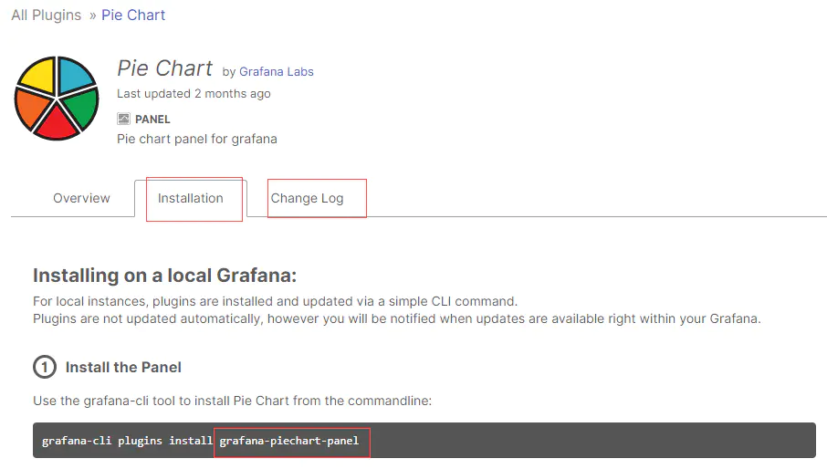
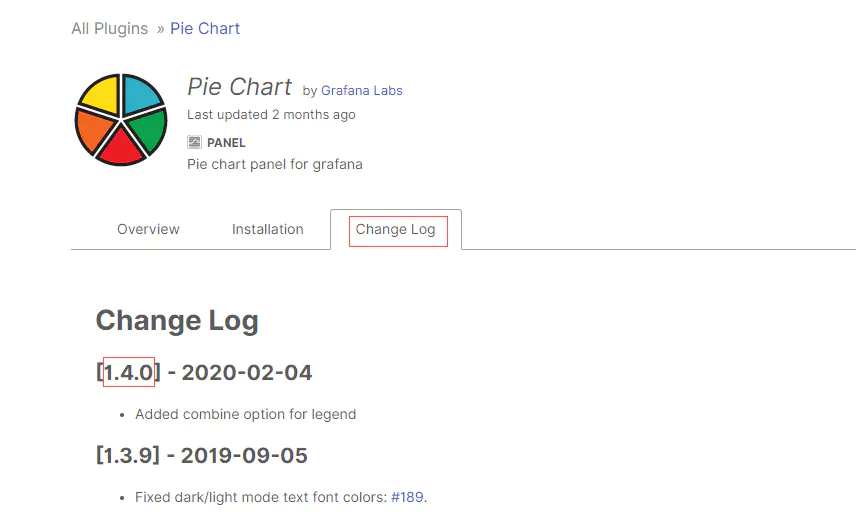
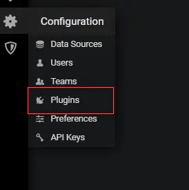
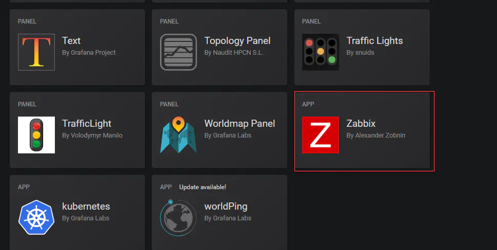
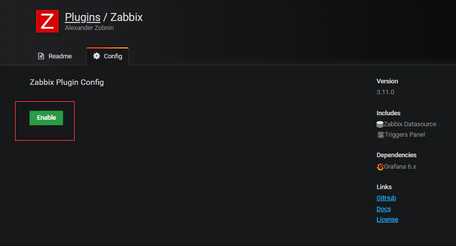
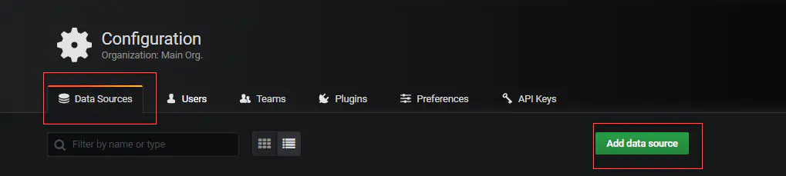
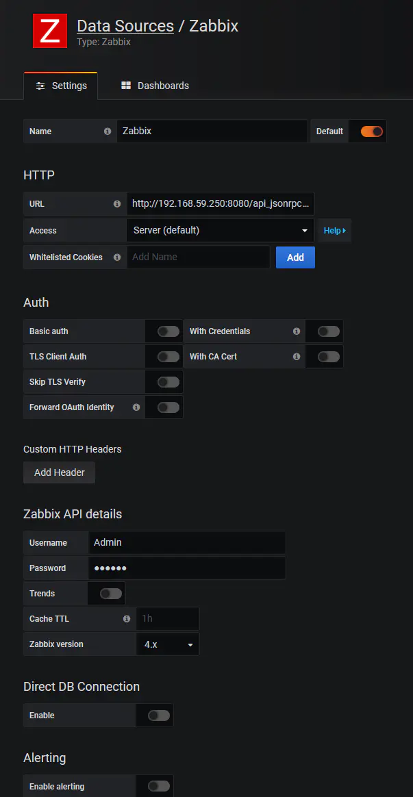
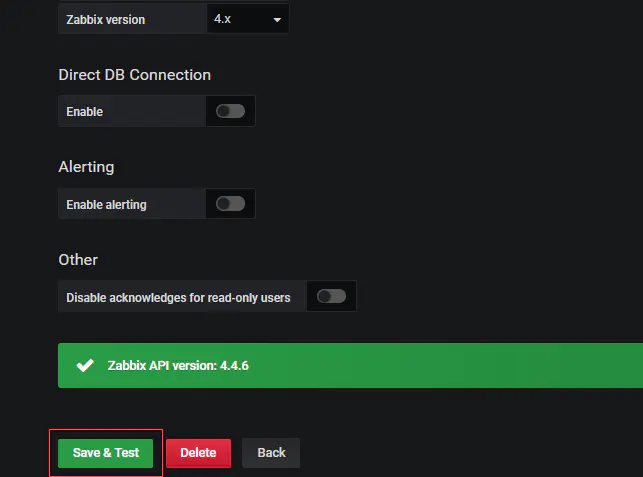

**一、在线安装插件**

如果不指定插件安装位置，则默认安装位置为/var/lib/grafana/plugins；插件安装后需要重启grafana-server

安装zabbix插件alexanderzobnin-zabbix-app

```shell
grafana-cli plugins install alexanderzobnin-zabbix-app
```

这个时候你会发现安装的目录在`into: /var/lib/grafana/plugins`，这是因为这个命令脚本中已经指定了该路径，我们可以通过修改来覆盖。

```shell
# 修改PLUGINS_DIR属性的路径
vim /usr/sbin/grafana-cli 
# 移动刚刚已经下载好的zabbix插件
cp -r /var/lib/grafana/plugins/alexanderzobnin-zabbix-app /data/grafana/plugins/
```

使用--pluginsDir指定安装路径

\# grafana-cli --pluginsDir=/data/grafana/plugins plugins install alexanderzobnin-zabbix-app  

重启grafana-server，每次下载好插件之后都必须重启

```shell
systemctl restart grafana-server
```

**二、手动下载离线安装插件**

若插件安装时下载超时，可以手动下载安装

手动下载安装方式步骤如下：

第一步：访问grafana官网https://grafana.com/grafana/plugins?orderBy=weight&direction=asc

第二步：查找要下载的插件，如：Pie Chart


第三步：从Installation和Change Log中分别获取到插件名和版本号，得到下载地址





则下载地址为：https://grafana.com/api/plugins/

第四步：下载并解压到插件目录，重启grafana-server使生效。  **这里我没去试，记得去上面的下载地址看看版本号。**

```shell
wget https://grafana.com/api/plugins/grafana-piechart-panel/versions/1.4.0/download -O grafana-piechart-panel.zip
unzip grafana-piechart-panel.zip
mv grafana-piechart-panel-b707cd5/ /data/grafana/plugins/grafana-piechart-panel
systemctl restart grafana-server
```

**常用插件下载**

```shell
grafana-cli plugins install alexanderzobnin-zabbix-app
grafana-cli plugins install grafana-piechart-panel
grafana-cli plugins install agenty-flowcharting-panel
grafana-cli plugins install grafana-clock-panel
grafana-cli plugins install pierosavi-imageit-panel
grafana-cli plugins install jdbranham-diagram-panel

# 下载完记得重启
systemctl restart grafana-server
```

**三、配置Zabbix数据源**

安装好alexanderzobnin-zabbix-app插件并重启grafana-server后，我们就可以在Plugins(插件)列表中看到zabbix图标，如下图所示。





点击Zabbix图标，点击"Enable"，激活Zabbix插件，如下图所示。



完成上述Enable操作后，再回到"Data Sources" 菜单，点击"Add data source"，添加数据源，如下图所示。



在URL栏输入Zabbix的接口地址，如http://192.168.59.250:8080/api_jsonrpc.php，在Useranme和Password输入Zabbix的登录用户以及密码（为安全起见，也可以在Zabbix中为Grafana创建只读用户）如下图所示。



完成上述相关设置后，点击"Save & Test" 完成测试，若返回绿色状态，则表示Zabbix数据源配置成功，如下图所示。




完成数据源接入后，接下来就到了图表化展示数据的时候了。

总结：坚持只是一种漫长的过程，最终也不一定会有你想要的结果。

 