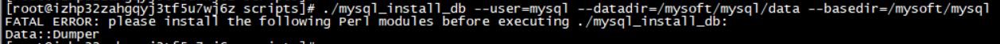

# 安装


1. 首先打开编辑器

yum install mysql-community-server

2.在打开的vi 编辑器中输入：

```html
# Enable to use MySQL 5.6
[mysql56-community]
name=MySQL 5.6 Community Server
baseurl=http://repo.mysql.com/yum/mysql-5.6-community/el/6/$basearch/
enabled=1
gpgcheck=0
gpgkey=file:///etc/pki/rpm-gpg/RPM-GPG-KEY-mysql3
```

3.保存后输入：

yum repolist enabled | grep mysql

> 查看是否版本是5.6的

4. 安装服务

yum install mysql-community-server

5. 启动服务

service mysqld start 

service mysqld restart

6. Linux下设置Mysql表名不区分大小写

用root账号登录后vi /etc/my.cnf 在[mysqld]下面加lower_case_table_names=1

7. 设置允许远程登录

mysql> use mysql;

查看用户

select host,user,password from user;

修改用户

update user set password=password('123456') where user='root';

刷新权限

flush privileges;


# 卸载Mysql

1： 检查是否安装了MySQL组件。

[root@DB-Server init.d]# rpm -qa | grep -i mysql
	mysql-community-client-5.7.19-1.el7.x86_64
	mysql-community-common-5.7.19-1.el7.x86_64
	mysql-community-libs-compat-5.7.19-1.el7.x86_64
	mysql-community-libs-5.7.19-1.el7.x86_64
	qt-mysql-4.8.5-13.el7.x86_64
	mysql57-community-release-el7-11.noarch
	mysql-community-server-5.7.19-1.el7.x86_64
	perl-DBD-MySQL-4.023-5.el7.x86_64
2： 卸载前关闭MySQL服务

systemctl stop mysqld

yum -y remove mysql-community-client-5.7.19-1.el7.x86_64
yum -y remove mysql-community-common-5.7.19-1.el7.x86_64
yum -y remove mysql-community-libs-compat-5.7.19-1.el7.x86_64
yum -y remove mysql57-community-release-el7-11.noarch
yum -y remove mysql-community-server-5.7.19-1.el7.x86_64

3：删除MySQL对应的文件夹

```shell
[root@DB-Server init.d]# whereis mysql
mysql:
[root@DB-Server init.d]# find / -name mysql
/var/lib/mysql
/var/lib/mysql/mysql
/usr/lib64/mysql
[root@DB-Server init.d]# rm -rf /var/lib/mysql
[root@DB-Server init.d]# rm -rf /var/lib/mysql/mysql
[root@DB-Server init.d]# rm -rf /usr/lib64/mysql
```


4：确认MySQL是否卸载删除

[root@DB-Server init.d]# rpm -qa | grep -i mysql

5：重新安装MySQL5.6版本，主要参考 （略写，主要参考以下链接）

 http://blog.csdn.net/huhuhuemail/article/details/77498891

> 这里主要是因为上次已经将服务删除了,需要重新更新一下才能通过yum继续下载

shell> wget https://dev.mysql.com/get/mysql57-community-release-el7-11.noarch.rpm
shell> yum mysql57-community-release-el7-11.noarch.rpm 
这步如果报错：已加载插件：fastestmirror, langpacks
没有该命令：mysql57-community-release-el7-11.noarch.rpm。请使用 /usr/bin/yum --help
改用以下命令：
yum localinstall mysql57-community-release-el7-11.noarch.rpm  
shell> yum repolist enabled | grep "mysql.*-community.*"

**这里是重新安装，如果你需要安装的是5.6的可以从头开始看** 

shell> yum install mysql-community-server
修改mysql配置文件

启动MySQL服务
--------------------- 


# 修改数据库表情字符集


/etc/my.conf

```shell
[client]
default-character-set = utf8mb4


[mysql]
default-character-set = utf8mb4


[mysqld]
character-set-client-handshake=false
character-set-server=utf8mb4
init_connect='SET NAMES utf8mb4'

```

查看结果 : 

SHOW VARIABLES WHERE Variable_name LIKE 'character\_set\_%' OR Variable_name LIKE 'collation%'


## 网上摘抄的

# [linux下安装mysql-5.6.41](https://www.cnblogs.com/wuzhenzhao/p/10178458.html)

 1.下载安装包，下载地址:[ https://dev.mysql.com/downloads/mysql/5.7.html#downloads](https://dev.mysql.com/downloads/mysql/5.7.html#downloads) 。选择完版本，然后点击下方 **No thanks, just start my download.**

　　先看一下我服务器的版本信息: lsb_release -a 列出所有版本信息


　　查看内核版本信息：cat /proc/version


　　在下载页面选择一个版本，我选择的版本是：mysql-5.6.41-linux-glibc2.12-x86_64.tar.gz


2.将 tar 包上传至服务器，我这边存放位置为 /mysoft下：


3.解压安装包 tar -zxvf mysql-5.6.41-linux-glibc2.12-x86_64.tar.gz

4.将解压后的文件夹 mysql-5.6.41-linux-glibc2.12-x86_64 重命名为 mysql，mv mysql-5.6.41-linux-glibc2.12-x86_64 mysql 

5.添加用户mysql组 ：groupadd mysql

6.添加用户 mysql 到 mysql 组： useradd -g mysql mysql

7.进入mysql 文件夹，创建数据目录 mkdir data ，默认的数据库目录可以在 my.cnf 文件内查看。

8.设置 data 目录权限 chown -R mysql:mysql data


9.退出到 mysql 文件夹 执行数据库初始化：./scripts/mysql_install_db --user=mysql --datadir=/mysoft/mysql/data --basedir=/mysoft/mysql

　出现问题：



　解决 ：yum -y install autoconf

　再次执行，还报错：


  解决 ：yum install libaio* -y

　再次执行初始化，完成。

\10. 设置启动脚本：cp support-files/mysql.server /etc/init.d/mysqld

\11. chmod 755 /etc/init.d/mysqld

\12. cp support-files/my-default.cnf /etc/my.cnf

13.修改 /etc/my.cnf ，/etc/init.d/mysqld 如下：

```
`datadir=/mysoft/mysql/data``basedir=/mysoft/mysql`
```

\14. 启动 service mysqld start，查看状态/停止服务 service mysqld status/stop

15.连接数据库，进入bin目录： ./mysql

16.切换数据库 use mysql


17.通过sql语句，将user表的 host 改为 %,否则外网通过客户端工具会链接不上，update user set host ='%'where user ='root' and host ='localhost';


18.修改 root 用户密码 ：update user set password=password("你的新密码") where user="root";

19.安全起见，建议删除匿名用户，保证数据库安全。delete from user where user='';

　　安装完成。记得开放服务器端口。然后去连接。

20.执行 flush privileges; 重新加载权限表; 更新权限;

 

21.配置环境变量 vim /etc/profile 

```
`export PATH=$PATH:/mysoft/mysql/bin`
```

