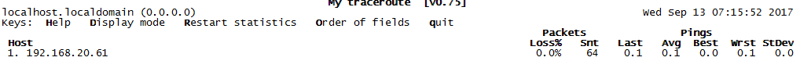

# 流量过高定位

## 如何定位哪个进程流量过高?

```shell
yum install nethogs
nethogs
```

使用介绍: 

```xml
m : Cycle between display modes (kb/s, kb, b, mb) 切换网速显示单位
r : Sort by received. 按接收流量排序
s : Sort by sent. 按发送流量排序
q : Quit and return to the shell prompt. 退出NetHogs命令工具
```

**NetHogs 命令行参数**

常用的参数：

> -d delay for refresh rate. 数据刷新时间 如nethogs -d 1 就是每秒刷新一次
>
> -h display available commands usage. 显示命名帮助、使用信息
>
> -p sniff in promiscious mode (not recommended).
>
> -t tracemode.
>
> -V prints Version info.

演示例子：

\#5秒刷新一次数据

nethogs -d 5

\#监控网卡eth0数据

nethogs eth0

\#同时监视eth0和eth1接口

nethogs eth0 eth1

\#将监控日志写入日志文件
nethogs >>test.log


# 使用Linux命令查看

## 查看网卡使用情况

```shell
sar -n DEV 2 10 
```

- IFACE : LAN接口，网络设备的名称
- rxpck/s : 每秒钟接收的数据包
- txpck/s : 每秒钟发送的数据包
- rxbyt: 每秒钟接收的字节数
- txbyt : 每秒钟发送的字节数
- rxcmp : 每秒钟接收的压缩数据包
- txcmp/s : 每秒钟发送的压缩数据包
- rxmcst/s : 每秒钟接收的多播数据包

如果想进一步验证网卡是否已经到了极限值，可以使用iperf3命令查看。还可以使用netstat -t 查看网卡的连接情况，看是否有大量连接造成阻塞。

然后使用iostat 查看磁盘使用情况:

```shell
iostat -xdm 1
```

定位网卡、磁盘、CPU是否到达极限。


## 丢包问题定位排查

### mtr

MTR是Linux平台上一款非常好用的网络诊断工具，或者说网络连通性判断工具，集成了traceroute、ping、nslookup的功能，用于诊断网络状态非常有用。

**一、安装**

```
`$ yum install mtr       #适用于centos``$ sudo apt-get install mtr  #适用于debian/ubuntu`
```


**二、Mtr相关参数**

```
$ mtr -h #提供帮助命令
$ mtr -v #显示mtr的版本信息
$ mtr -r #已报告模式显示
$ mtr -s #用来指定ping数据包的大小
$ mtr --no-dns #不对IP地址做域名解析
$ mtr -a #来设置发送数据包的IP地址 这个对一个主机由多个IP地址是有用的
$ mtr -i #使用这个参数来设置ICMP返回之间的要求默认是1秒
$ mtr -4 #IPv4
$ mtr -6 #IPv6
```

 

**二、用法简介**

```
# mtr 192.168.20.61
```



第一列（Host）：IP地址和域名，按n键可以切换IP和域名

第二列（Loss%）：丢包率

第三列（Snt）：设置每秒发送数据包的数量，默认值是10 可以通过参数-c来指定

第四列（Last）：最近一次的PING值

第五列（Avg）：是平均值 这个应该是发送ping包的平均时延

第六列（Best）：是最好或者说时延最短的

第七列（Wrst）：是最差或者说时延最常的

第八列（StDev）：标准偏差

