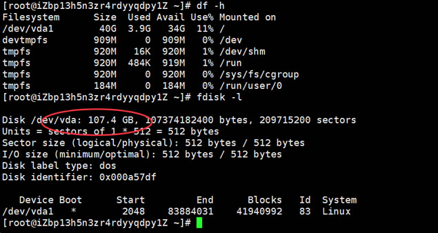
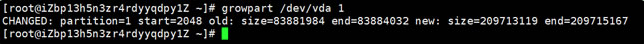
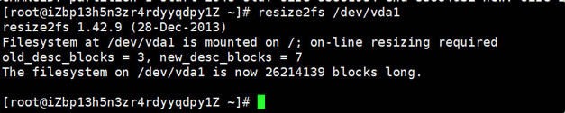
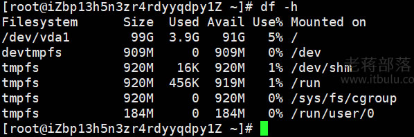

# 在线扩容

## 1. 付款

付款完成查看

```shell
fdisk -l
```



 可以看到我们的磁盘是有100GB，但是实际上只用到40GB，还需要手动调整。 

 这里我是用的CentOS7，安装安装growpart或者xfsprogs扩容格式化工具。 

```shell
yum install cloud-utils-growpart yum install xfsprogs -y
```

 然后我们用growpart为需要扩容的云盘和对应的第几个分区扩容。 

```shell
growpart <DeviceName> <PartionNumber>
```

实际操作

```shell
growpart /dev/vda 1
```



 然后在运行 resize2fs <PartitionName>调用resize2fs扩容文件系统： 

```shell
resize2fs /dev/vda1
```



最后，我们再看看当前系统磁盘

```shell
df -h
```

