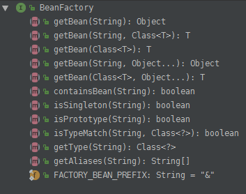
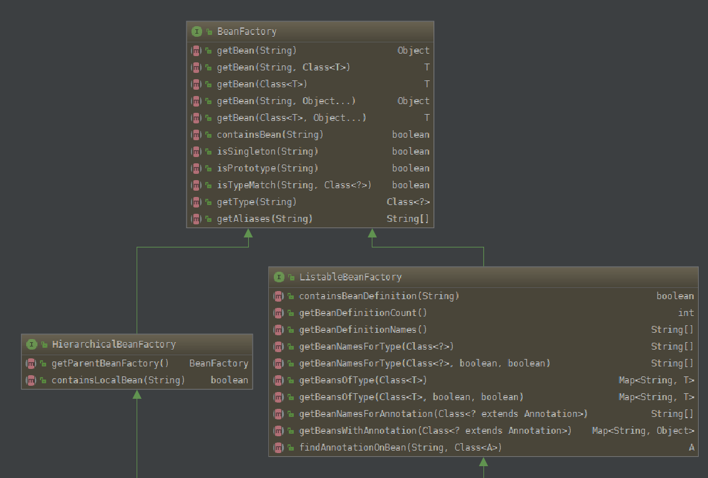
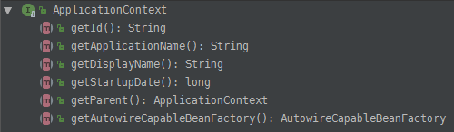

# BeanFactory

### 方法介绍:

- getBean

获取工厂中的bean对象,可以通过id,类型

- containsBean

查看工厂中是否包含bean的id

- isSingleton

是否为单例bean

- isPrototype 

是否为原型bean

- isTypeMatch

是否为正则匹配的类型

**总的来说是对工厂中的一些常规操作的规范做定义.描述了这个工厂中的一些操作方法**

## 具体实现类

####  ClassPathXmlApplicationContext

- HierarchicalBeanFactory

持有工厂对象的接口定义,查看是否拥有包含该本地bean的对象

- ListableBeanFactory

对bean的Definition对象做一些接口规范

- ApplicationContext

对上下文对象的一些信息进行定义

