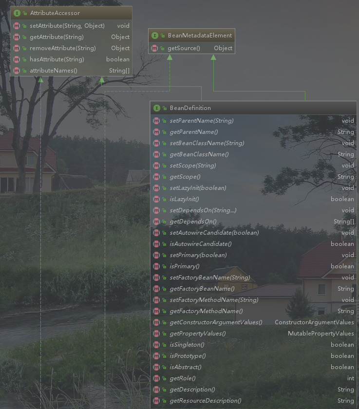
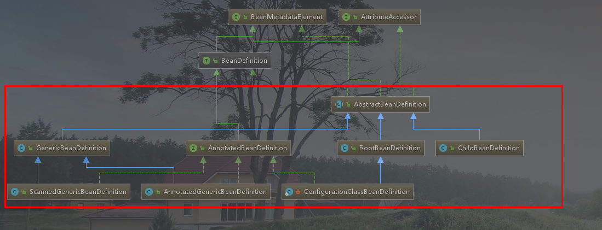
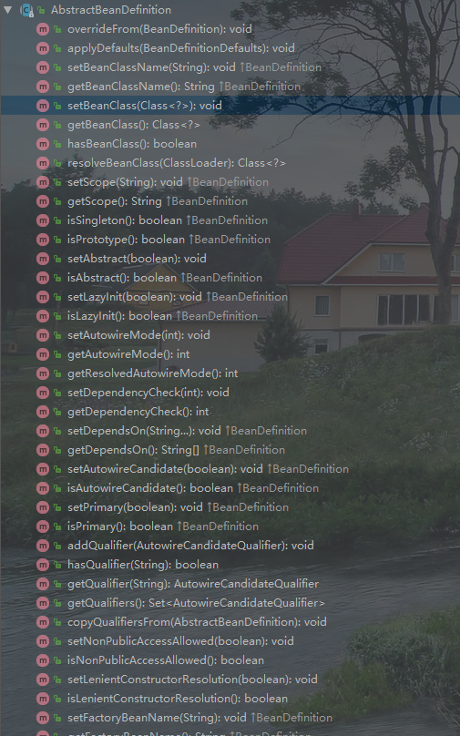
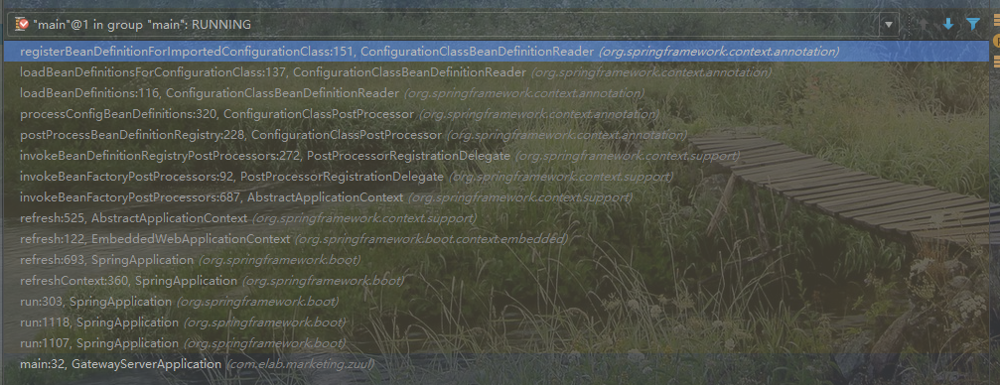

# BeanDefinition

- 首先我们需要了解`BeanDefinition`到底是个什么东西?
- 了解Spring基于`BeanDifination`对象做了哪些实现？
- 基于Spring是如何使用`Beandifination`对象来操作的。

## 首先我们需要了解`BeanDefinition`到底是个什么东西?



从IDEA的关系图上来看`Beandefinition`对象具有如下特点:

- 拥有属性存储的功能[**AttributeAccessor**]
- 拥有资源获取的能力，也就是读取配置资源的能力【BeanMatadataElement】
- 对Bean对象的描述能力[**BeanDefinition**]

## 了解Spring基于`BeanDifination`对象做了哪些实现？

通过了解Spring的实现，能够知道这个东西的实现方式以及作者对实现模型的定位。



图中红线框柱的部分则是针对`Beandifination`的具体实现:

我们先从`AbstractBeanDefinition`对象开始了解



从上述实现方法来看，该类就是实现了`BeanDefinition`的所有方法。

而其他的子类:

`GenericBeanDefinition` : 通用的bean实现，自2.5以后新加入的bean文件配置属性定义类，是`ChildBeanDefinition`和`RootBeanDefinition`更好的替代者，

​	`ScannedGenericBeanDefinition` : 被包扫描到的bean定义

​	`AnnotatedGenericBeanDefinition` : 查找类注解初始化的定义

`RootBeanDefinition` : 代表一个从配置源（`XML`，`Java Config`等）中生成的`BeanDefinition`

`ChildBeanDefinition` : 可以从父`BeanDefinition`中集成构造方法，属性等。


## 基于Spring是如何使用`Beandifination`对象来操作的?

我们从最常用的三个类取看:

**`GenericBeanDefinition`** : 普通的bean的注册，大部分通用个的Bean的注册方式。

`ScannedGenericBeanDefinition`

它的类是在`ClassPathScanningCandidateComponentProvider.findCandidateComponents`方法中被调用

```java
public Set<BeanDefinition> findCandidateComponents(String basePackage) {
    Set<BeanDefinition> candidates = new LinkedHashSet<BeanDefinition>();
    String packageSearchPath = ResourcePatternResolver.CLASSPATH_ALL_URL_PREFIX +
        resolveBasePackage(basePackage) + '/' + this.resourcePattern;
    Resource[] resources = this.resourcePatternResolver.getResources(packageSearchPath);
    boolean traceEnabled = logger.isTraceEnabled();
    boolean debugEnabled = logger.isDebugEnabled();
    for (Resource resource : resources) {
        MetadataReader metadataReader = this.metadataReaderFactory.getMetadataReader(resource);
        if (isCandidateComponent(metadataReader)) {
            ScannedGenericBeanDefinition sbd = new ScannedGenericBeanDefinition(metadataReader);
        }
    }
    // 部分代码省略
	return candidates;
}
```

这是统一的入口，看这个方法名就可以知道，通过定义填写了`basePackage`的相关注解，最终都会经过方法去查找，并且会包装成`ScannedGenericBeanDefinition`对象。

`AnnotatedGenericBeanDefinition`

我们先在实例化处打个断点看看它是如何被执行的。



分析链路(只选举关键链路):

`invokeBeanDefinitionRegistryPostProcessors`:  执行Bean中实现了`BeanDefinitionRegistryPostProcessor`的类的`postProcessBeanDefinitionRegistry`方法，目标类可以看到是:`ConfigurationClassPostProcessor`

`processConfigBeanDefinitions` : 断点在循环遍历Bean的时候，会去判断Bean上面的注解。

如果包含有`@Import`、@Configuration等注解，则会采用

这里可以大概知道`GenericBeanDefinition`、`AnnotatedGenericBeanDefinition`、`ScannedGenericBeanDefinition`等类都是针对配置类型的Bean定义。

那么常用的Bean呢?

`RootBeanDefinition`: 普通Bean的定义

它的作用也是封装对象的信息，不过不同于配置对象，他是更为普通的Bean类型。

在创建bean的实例的同时，都是以`RootBeanDefinition`来做处理

**AbstractBeanFactory.java**

```java
// 创建Bean的时候触发
protected <T> T doGetBean(
			final String name, final Class<T> requiredType, final Object[] args, boolean typeCheckOnly)
			throws BeansException {

		final String beanName = transformedBeanName(name);
		Object bean;
		// 部分省略
	 
        final RootBeanDefinition mbd = getMergedLocalBeanDefinition(beanName);
        checkMergedBeanDefinition(mbd, beanName, args);

        // Guarantee initialization of beans that the current bean depends on.
        String[] dependsOn = mbd.getDependsOn();
        if (dependsOn != null) {
            
        } 
        // Create bean instance.
        if (mbd.isSingleton()) {
            //创建单例工厂
        }

        else if (mbd.isPrototype()) {
            // 是否原型
        } else {
            // 获取scope
            String scopeName = mbd.getScope(); 
        } 
		return (T) bean;
	}

```


其实我的理解就是描述了Bean的对象，方便在实例化的时候做一些特殊操作。比如@Autowired等注解。

`BeanDefinition`也有对应的拓展点: `BeanDefinitionRegistryPostProcessor`

举个常用的案例:Mybatis

大家都知道`Mybatis`的`Mapper`是不需要实现类的，只需要定义一个接口就行了，但是它是如何通过Spring拿到对应的实现的呢？

在Spring容器启动的时候，在解析完了配置文件之后。开始执行Spring内部拓展接口的调用其中包括了

`BeanPostProcess`、`BeanDefinitionRegistryPostProcessor`.

`BeanPostProcess`: 针对每个bean的实例化之前和之后会触发。

`BeanDefinitionRegistryPostProcessor` : 发生的比上面要早，在bean还处于`BeanDefinition`加载完毕之后的阶段。

Mybatis就是基于这个时机通过`MapperScannerConfigurer`触发了`BeanDefinitionRegistryPostProcessor`的`postProcessBeanDefinitionRegistry`方法的调用。

这个时候需要告诉Mybatis你的`basePackage`、`sqlSessionFactory`、`sqlSessionTemplate`等等属性，

- 要扫描的包
- 配置文件解析对象
- SQL执行对象

有了这三个功能基本上已经具备了执行SQL的条件。

这时候MapperScannerConfigurer需要为扫描包下面的接口指定一个具体实现`MapperFactoryBean`。不然这个构建的BeanDefinition是没有用的。

指定了具体实现之后将上面三个关键属性交给`MapperFactoryBean`管理。

这个时候大概明白了，所有的Mapper的具体实现都是MapperFactoryBean。

而`MapperFactoryBean`也具备了执行SQL的条件。

后面都是些细节的执行过程就不细究了，比如通过接口的包+类名+方法名和xml中的对象相对应得到具体的执行SQL。


以上是仅从个人观点，希望会给大家带来一些帮助。有问题请及时指正。


