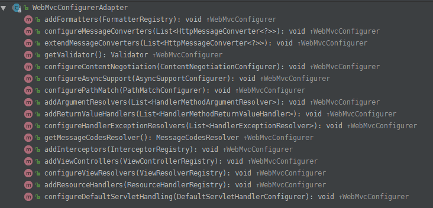
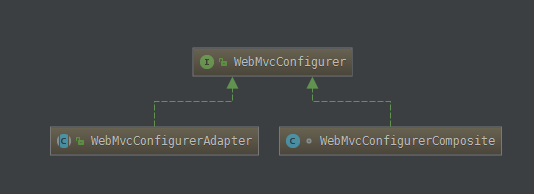

# 实现Spring零配置搭建

最近在为去除配置文件做了一些研究,基于Spring 4 的一些特性将原来有配置的地方全部转化成了基于注解的形式,发现Spring的强大不是一点点.

以下是对Spring的改造做了一些记录:

## Spring

### 注解介绍

- `@Configuration`，用于表示这个类是一个配置类，用于配置Spring的相关信息
- `@EnableAspectJAutoProxy`，启用切面自动代理，用于AOP

等价于

```xml
<aop:aspectj-autoproxy></aop:aspectj-autoproxy>
```

- `@EnableTransactionManagement`，启用注解事务，即可以使用@Transactional注解来控制事务,具体实现

**TransactionManagementConfigurer** -> 等价于

```xml
<tx:annotation-driven transaction-manager="transactionManager"
                          proxy-target-class="true"></tx:annotation-driven>
```

- `@EnableCaching`:启用缓存实现,这里是针对于Spring定义的缓存实现,具体实现类:**CachingConfigurerSupport**等价于

```xml
<cache:annotation-driven error-handler="defaultErrorCacheHandle" key-generator="defaultCacheKeyGenerator"/>
```


- `@ComponentScan`，组件扫描，在basePackages指定的目录下扫描被@**Controller**、@**Service**、@**Component**等注解注册的组件
- `@Import`，引入指定的配置类，我们引入了Spring容器配置类和数据源事务配置类
- `@PropertySource`，加载指定的配置文件，配置文件内容会加载入Environment中等待调用

#### 去除配置中的AOP动态代理

1. xml

```xml
<aop:aspectj-autoproxy></aop:aspectj-autoproxy>
     <!-- 多数据源切面类 -->
    <bean id="manyDataSourceAspect" class="com.elab.core.aop.DataSourceAspect"/>
    <!-- 多数据Aop配置 -->
    <aop:config proxy-target-class="true">
    <!-- 定义一个切入点表达式： 拦截哪些方法 -->
    <aop:aspect ref="manyDataSourceAspect">
      <aop:before method="before" pointcut="execution(* com.elab.ecrm.services..*.*(..))">		  </aop:before>
      <aop:after-returning pointcut="execution(* com.elab.ecrm.services..*.*(..))"
      arg-names="point,retValue" returning="retValue" method="after"/>
      </aop:aspect>
</aop:config>
```

2. 注解

```java
@Aspect
@EnableAspectJAutoProxy
@Configuration
public class DataSourceAopConfigBean { 
    @Bean
    public DataSourceAspect getDataSourceAspect() {
        DataSourceAspect catAspect = new DataSourceAspect();
        return catAspect;
    }

    @Before(value = "execution(* com.elab.ecrm.services..*.*(..))")
    public void dataSourceBefor(JoinPoint pjp) throws CoreException {
        getDataSourceAspect().before(pjp);
    }

}
```

#### 去除配置中的数据源

其实这里就和普通的bean定义没什么差别

```xml
<bean id="default" class="com.alibaba.druid.pool.DruidDataSource" destroy-method="close">
  <property name="driverClassName" value="${default.driverClassName}"></property>
  <property name="url" value="${default.url}"></property>
  <property name="username" value="${default.username}"></property>
  <property name="password" value="${default.password}"></property>
  <property name="filters" value="${default.filters}"/>
  <!-- 配置初始化大小、最小、最大 -->
  <property name="initialSize" value="${default.initialSize}"/>
  <property name="minIdle" value="${default.minIdle}"/>
</bean>
```

```java
@EnableWebMvc
@PropertySource({"classpath:database.properties"})
@Configuration
public class DataSourceConfigBean {
 
    @Autowired
    private Environment env;

    @Bean(name = "default")
    public DataSource getDefaultDataSource() throws SQLException {
        DruidDataSource dataSource = new DruidDataSource();
        dataSource.setDriverClassName(env.getProperty("default.driverClassName"));
        dataSource.setUrl(env.getProperty("default.url"));
        dataSource.setUsername(env.getProperty("default.username"));
        dataSource.setPassword(env.getProperty("default.password"));
        dataSource.setFilters(env.getProperty("default.filters"));
        dataSource.setInitialSize(Integer.parseInt(env.getProperty("default.initialSize")));
        dataSource.setMinIdle(Integer.parseInt(env.getProperty("default.minIdle")));
        dataSource.setMaxActive(Integer.parseInt(env.getProperty("default.maxActive")));
        return dataSource;
    }
 
}
```

#### 配置中的事务

```xml
<bean id="jdbcTemplate" class="org.springframework.jdbc.core.JdbcTemplate">
  <property name = "dataSource" ref="default"/>
</bean>
<bean id="transactionManager" class="com.elab.ecrm.utils.DataSourceTransactionManager">
  <property name="dataSource" ref="default"/> 
</bean>
```

```java
@EnableTransactionManagement
@Configuration
public class TransactionConfigBean implements TransactionManagementConfigurer {

    @Qualifier("default")
    @Autowired
    private DataSource dataSource;

    @Override
    public PlatformTransactionManager annotationDrivenTransactionManager() {
        return getDataSourceTransactionManager();
    } 
    @Bean
    public DataSourceTransactionManager getDataSourceTransactionManager() {
        DataSourceTransactionManager transactionManager = new DataSourceTransactionManager();
        transactionManager.setDataSource(dataSource);
        return transactionManager;
    }

    @Bean
    public JdbcTemplate getJDBCTemplate() {
        JDBCTemplate jdbcTemplate = new JDBCTemplate(); 
        return jdbcTemplate;
    }

}

```

#### 普通的Bean定义

```xml
 <bean id="httpClientFactory" 
       class="org.springframework.http.client.SimpleClientHttpRequestFactory">
   <property name="connectTimeout" value="120000"/>
   <property name="readTimeout" value="120000"/>
</bean>
<!--RestTemplate-->
<bean id="restTemplate" class="org.springframework.web.client.RestTemplate">
    <constructor-arg ref="httpClientFactory"/>
</bean>
```

```java
@Configuration
// 这里默认只扫Spring相关的,去除Controller相关的
@ComponentScan(basePackages = {"com.*.*.*"}, excludeFilters = {
        @ComponentScan.Filter(type = FilterType.ANNOTATION, value = {Controller.class})
})
public class BeanConfig {

    @Bean
    public ClientHttpRequestFactory getClientHttpRequestFactory() {
        SimpleClientHttpRequestFactory simpleClientHttpRequestFactory = new SimpleClientHttpRequestFactory();
        simpleClientHttpRequestFactory.setConnectTimeout(120000);
        simpleClientHttpRequestFactory.setReadTimeout(120000);
        return simpleClientHttpRequestFactory;
    }

    @Bean
    public RestTemplate getRestTemplate() {
        RestTemplate restTemplate = new RestTemplate(getClientHttpRequestFactory());
        return restTemplate;
    }
}
```


#### 缓存替代

基于Spring的缓存接口做替换

```xml
<cache:annotation-driven error-handler="defaultErrorCacheHandle" key-generator="defaultCacheKeyGenerator"/>
```

```java
@EnableCaching
@Configuration
public class RedisBeanConfig extends CachingConfigurerSupport {

    @Value("${domain}")
    private String domain; 
  
    @Autowired
    private org.springframework.core.env.Environment env;

    @Override
    public KeyGenerator keyGenerator() {
        return getDefaultCacheKeyGenerator();
    }

    @Override
    public CacheErrorHandler errorHandler() {
        return getErrorCacheHandle();
    }

    @Override
    public CacheManager cacheManager() {
        return getCompositeCacheManager();
    }
}
```


## SpringMVC

### 注解介绍

- `@EnableWebMvc` :  开启SpringMVC的支持，注册了这个方法并且实现了WebMvcConfigurerAdapter类的话,就拥有相当SpingMVC配置文件中的所有属性了



将这个类注册到容器时,会触发一个`DelegatingWebMvcConfiguration`委托类的注册的`setConfigurers`方法

```java
@Autowired(required = false)
public void setConfigurers(List<WebMvcConfigurer> configurers) {
   if (configurers == null || configurers.isEmpty()) {
      return;
   }
   this.configurers.addWebMvcConfigurers(configurers);
}
```

这个方法会将所有实现WebMvcConfigurer接口的方法全部注册进来,WebMvcConfigurerAdapter已经实现了接口



所以重写过的所有方法都会被触发注册


#### 拦截器

```xml
<mvc:interceptors>
        <!-- 使用bean定义一个Interceptor，直接定义在mvc:interceptors根下面的Interceptor将拦截所有的请求 -->
  <mvc:interceptor>
    <mvc:mapping path="/**"/>
    <!-- 需排除拦截的地址 -->
    <mvc:exclude-mapping path="/"/>
    <!-- 定义在mvc:interceptor下面的表示是对特定的请求才进行拦截的 -->
    <bean class="com.demo.log.asepct.TimeInterceptor"/>
  </mvc:interceptor>
</mvc:interceptors>
```

这里只需要根据业务实现从**WebMvcConfigurerAdapter**重写自己需要的方法即可

```java
@Configuration
@EnableWebMvc
// 这里只扫描和MVC相关的注解,为了和Spring容器区分开
@ComponentScan(basePackages = {"com.elab.ecrm.controllers"}, includeFilters = {
        @ComponentScan.Filter(type = FilterType.ANNOTATION, value = {Controller.class})
})
public class MvcConfigBean extends WebMvcConfigurerAdapter {
    @Override
    public void addInterceptors(InterceptorRegistry registry) {
 	registry.addInterceptor(getTimeHandlerInterceptor())
   		.addPathPatterns("/**")
         .excludePathPatterns("/");
    }
  
  public HandlerInterceptor getTimeHandlerInterceptor() {
        return new TimeInterceptor();
    }
}
```


## web.xml

**从前Spring和SpringMVC的启动入口** , 由于Spring 4是基于Servlet 3.0以上实现的 , 所以Spring提供了SpringServletContainerInitializer这个类可以做为一个入口类.

[参考](http://tramp-zzy.iteye.com/blog/2319916)

```xml
<context-param>
  <param-name>contextConfigLocation</param-name>
  <param-value>
    classpath:applicationContext-datasource.xml
  </param-value>
</context-param>
<listener>
  <listener-class>org.springframework.web.context.ContextLoaderListener</listener-class>
</listener>
<servlet>
  <servlet-name>appServlet</servlet-name>
  <servlet-class>org.springframework.web.servlet.DispatcherServlet</servlet-class>
  <init-param>
    <param-name>contextConfigLocation</param-name>
    <param-value>classpath:spring-mvc.xml</param-value>
  </init-param>
  <load-on-startup>1</load-on-startup>=
</servlet>
```

改成编程方式

```java

public class WebInitializer implements WebApplicationInitializer {
    private Logger logger = LoggerFactory.getLogger(WebInitializer.class);

    @Override
    public void onStartup(ServletContext servletContext) throws ServletException {
        logger.info("begin init web application.");
        long startTime = System.currentTimeMillis();
        CharacterEncodingFilter characterEncodingFilter = new CharacterEncodingFilter();
        characterEncodingFilter.setEncoding("UTF-8");
        //配置Spring
        AnnotationConfigWebApplicationContext springContext = new AnnotationConfigWebApplicationContext();
      	// 这里一般配置扫描类
        springContext.register(BeanConfig.class);

        //添加linstener
        servletContext.addListener(new ContextLoaderListener(springContext));

        //添加servlet
        ServletRegistration.Dynamic dispatcher = servletContext.addServlet(
                "dispatcher", new DispatcherServlet(springContext));
        dispatcher.setLoadOnStartup(1);
        dispatcher.addMapping("/");
        //添加filter
//        LoggerFilter loggerFilter = new LoggerFilter();
//        FilterRegistration.Dynamic logFilterRegistration=container.addFilter("requestResponseLogFilter", loggerFilter);
//        logFilterRegistration.addMappingForUrlPatterns(EnumSet.of(DispatcherType.REQUEST, DispatcherType.ASYNC), false, "/*");
        javax.servlet.FilterRegistration.Dynamic filter = servletContext.addFilter("encoding", characterEncodingFilter);
        long time = System.currentTimeMillis() - startTime;
        logger.info("init web application success. start count time : " + time);
    } 
} 
```

以上代码可以总结出来:

1. spring 将配置文件和编程方式做了共同的实现,稍微复杂的配置例如

```xml
<cache:annotation-driven />
<aop:aspectj-autoproxy />
<tx:annotation-driven />
```

Spring也通过编程方式去指定了具体的实现类,这个可以从注解类中的注释了解到

2. 启动方面基于Servlet 3去实现的,也能通过接口方式启动应用

由于代码中贴入的时候有一些去除,可能会导致阅读收到影响,这只是提供一些更改思路,可以照着这个来.基本上应该是OK的。

项目可以部署到tomcat中,无需纠结..