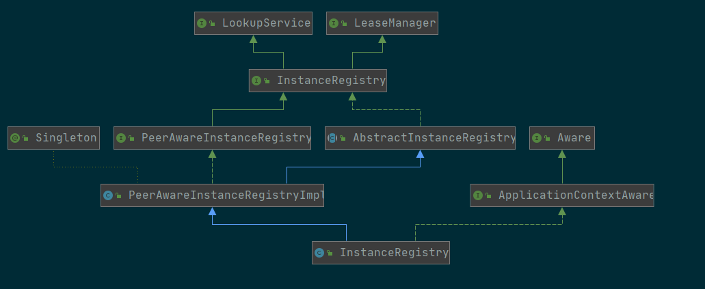

# Eureka简介

## 作用

- 服务的注册和发现
- 监控的微服务是否正常运行。
- 负载均衡
- 熔断
- 移除列表故障点
- 权重

## 简述

Eureka Server 作为服务注册功能的服务器，它是服务注册中心。而系统中的其他微服务，使用 Eureka 的客户端连接到 Eureka Server，并维持心跳连接。这样系统的维护人员就可以通过 Eureka Server 来监控系统中各个微服务是否正常运行。Spring Cloud 的一些其他模块（比如Zuul）就可以通过 Eureka Server 来发现系统中的其他微服务，并执行相关的逻辑。 

Eureka由两个组件组成：Eureka服务器和Eureka客户端。Eureka服务器用作服务注册服务器。Eureka客户端是一个java客户端，用来简化与服务器的交互、作为轮询负载均衡器，并提供服务的故障切换支持。Netflix在其生产环境中使用的是另外的客户端，它提供基于流量、资源利用率以及出错状态的加权负载均衡。 

## 实战

**pom.xml**

```xml
<dependencies>
	<dependency>
		<groupId>org.springframework.cloud</groupId>
		<artifactId>spring-cloud-starter</artifactId>
	</dependency>
	<dependency>
		<groupId>org.springframework.cloud</groupId>
		<artifactId>spring-cloud-starter-eureka-server</artifactId>
	</dependency>
	<dependency>
		<groupId>org.springframework.boot</groupId>
		<artifactId>spring-boot-starter-test</artifactId>
		<scope>test</scope>
	</dependency>
</dependencies>
```

启动类:

`EnableEurekaServer` : 表示该服务会作为Eureka的服务端

```java
@SpringBootApplication
@EnableEurekaServer
public class SpringCloudEurekaApplication {

	public static void main(String[] args) {
		SpringApplication.run(SpringCloudEurekaApplication.class, args);
	}
}
```

3、配置文件

在默认设置下，该服务注册中心也会将自己作为客户端来尝试注册它自己，所以我们需要禁用它的客户端注册行为，在`application.properties`添加以下配置：

```
spring.application.name=spring-cloud-eureka

server.port=8000
eureka.client.register-with-eureka=false
eureka.client.fetch-registry=false

eureka.client.serviceUrl.defaultZone=http://localhost:${server.port}/eureka/
```

- `eureka.client.register-with-eureka` ：表示是否将自己注册到Eureka Server，默认为true。
- `eureka.client.fetch-registry` ：表示是否从Eureka Server获取注册信息，默认为true。
- `eureka.client.serviceUrl.defaultZone` ：设置与Eureka Server交互的地址，查询服务和注册服务都需要依赖这个地址。默认是http://localhost:8761/eureka ；多个地址可使用 , 分隔。

具体参考 : http://www.ityouknow.com/springcloud/2017/05/10/springcloud-eureka.html


## 服务的调用

消费者需要通过注册中心去发现服务

###  如何判断该服务是消费者?

`EnableDiscoveryClient`: 具有了服务注册的功能。启动工程后，就可以在注册中心的页面看到服务。 

```
spring.application.name=spring-cloud-producer
```

### 服务之间如何通讯?

`@EnableFeignClients` : 启用feign进行远程调用 

> Feign是一个声明式Web Service客户端。使用Feign能让编写Web Service客户端更加简单, 它的使用方法是定义一个接口，然后在上面添加注解，同时也支持JAX-RS标准的注解。Feign也支持可拔插式的编码器和解码器。Spring Cloud对Feign进行了封装，使其支持了Spring MVC标准注解和HttpMessageConverters。Feign可以与Eureka和Ribbon组合使用以支持负载均衡。 

[参考链接](http://www.ityouknow.com/springcloud/2017/05/12/eureka-provider-constomer.html)

## eureka 配置介绍

### 服务端

**EurekaInstanceConfigBean**:

```properties
# 分组名称
setAppGroupName
# 应用名称 默认获取环境变量spring.application.name中的值
setAppname
# ASG的名称
setASGName
# 数据中心 这里包括Netflix、Amazon、MyOwn
setDataCenterInfo
# 设置默认的地址解析顺序
setDefaultAddressResolutionOrder
# 设置健康心跳检查URL 相对地址
setHealthCheckUrl
# 绝对地址
setHealthCheckUrlPath
# 主页地址
setHomePageUrl
# 主页绝对地址
setHomePageUrlPath
# 主机信息
setHostInfo
# 主机名称
setHostname
# 
setInetUtils
setInitialStatus
setInstanceEnabledOnit
setInstanceId
setIpAddress
# Eureka服务器在接收到实例的最后一次发出的心跳后，需要等待多久才可以将此实例删除，默认为90秒
setLeaseExpirationDurationInSeconds
eureka客户需要多长时间发送心跳给eureka服务器，表明它仍然活着,默认为30 秒
setLeaseRenewalIntervalInSeconds
setMetadataMap
setNamespace
setNonSecurePort
setNonSecurePortEnabled
setPreferIpAddress
# 安全心跳检测
setSecureHealthCheckUrl
setSecurePort
setSecurePortEnabled
# 安全虚拟机的名称 默认获取环境变量spring.application.name中的值
setSecureVirtualHostName
setStatusPageUrl
setStatusPageUrlPath
# 安全虚拟机的名称 默认获取环境变量spring.application.name中的值
setVirtualHostName
```

# 实现原理

**为什么要设置30秒?**

1. 间隔时间过短，服务数量和机器数量很大的话，请求压力会非常大。

> 假设服务100个，每个服务20台机器。那么实例就是2000个。
>
> eureka每30秒发送2次请求: 1. 拉取服务列表 2. 自身心跳。
>
> 每分钟就是 4 * 2000 = 8000个请求。
>
> 每秒就是 8000 / 60 = 133次 ，每秒也就是上百并发。
>
> 一天的话,就是千万级并发


## Eureka的存储结构

对应的类是 : `AbstractInstanceRegistry`， 对应的具体实现类：`org.springframework.cloud.netflix.eureka.server.InstanceRegistry`

存储的属性名叫: `registry` 对应的实体结构是`ConcurrentHashMap`，也就是说是基于纯内存存储。

### eureka的服务端初始化流程

基于`SpringBoot`配置服务端注册:

入口类: `EurekaServerAutoConfiguration` 

其中该类的静态方法才是初始化这个抽象实例注册的入口:

`org.springframework.cloud.netflix.eureka.server.EurekaServerAutoConfiguration#peerAwareInstanceRegistry`

看看这个类的关系图:




从关系图中我们可以知道，在不集成Spring的情况下到达`PeerAwareInstanceRegistryImpl` 这个接口类基本上就OK了，但是为了集成Spring拿到`IOC`的上下文，所以才衍生了`InstanceRegistry`。

`InstanceRegistry`还为注册、更新、取消提供了监听回调事件

分别对应了:

`EurekaInstanceRegisteredEvent`:  注册事件

`EurekaInstanceRenewedEvent` : 更新事件

`EurekaInstanceCanceledEvent` : 取消事件

> 也就是说是一旦eureka发生该事件的时候，订阅该数据事件的类会被触发。


### 客户端注册流程

启动触发的配置类:

`org.springframework.cloud.netflix.eureka.EurekaClientAutoConfiguration.RefreshableEurekaClientConfiguration#eurekaClient`

具体的客户端类:

`com.netflix.discovery.DiscoveryClient`

在构造方法里面初始化所有的流程

其中包含核心的线程:

- heartbeatExecutor : 心跳定时同步线程
- cacheRefreshExecutor : 缓存刷新线程，用于获取注册中心的数据存放在本地
- instanceInfoReplicator: 实例信息复制线程

通过scheduler调度器来定时调度线程:

**cacheRefreshExecutor**

调度条件`eureka.client.fetch-registry`为`true`的情况

调度时间相关配置

- `eureka.client.registry-fetch-interval-seconds`设定的时间来调度默认30秒
- `cache-eureka.client.cache-refresh-executor-exponential-back-off-bound`: 调用服务端缓存超时触发的延迟时间配置

**具体的线程执行类: `com.netflix.discovery.DiscoveryClient.CacheRefreshThread**`

**heartbeatExecutor**:

调度条件`eureka.client.register-with-eureka`为`true`的情况

调度时间相关配置:

- `eureka.instance.lease-renewal-interval-in-seconds`: 心跳定时调度时间，默认30秒
- `heartbeat-executor-exponential-back-off-bound`: 调用服务端缓存超时触发的延迟时间配置

具体的线程执行器:`com.netflix.discovery.DiscoveryClient.HeartbeatThread`

**instanceInfoReplicator**: 

实例信息维护类: 负责维护租期的续约时间、到期时间。

也就是维护`InstanceInfo`、`LeaseInfo`对象.


`eureka.instance.lease-expiration-duration-in-seconds` : 续约的有效租期默认90秒


`eureka.client.initial-instance-info-replication-interval-seconds` :  初始化实例信息复制的间隔秒数，默认40秒

`eureka.client.instance-info-replication-interval-seconds`: 实例信息复制间隔， 默认30秒，也就是上一个参数40秒后下一次每次按照多少秒继续执行

具体的执行器: `com.netflix.discovery.InstanceInfoReplicator`


### 服务端注册流程

com.netflix.eureka.registry.ResponseCacheImpl#readOnlyCacheMap

com.netflix.eureka.registry.ResponseCacheImpl#readWriteCacheMap

相关的配置属性:

```yaml
eureka.instance.lease-expiration-duration-in-seconds # 续约的到期时间 默认 90秒


```

1. 先从registry的Map中根据AppName获取对应的实例信息

结构目录: 

 - appName
   	- instanceId: `Lease<InstanceInfo>`

2. 根据实例的编号获取实例信息
3. 判断本次客户端的实例信息中最后一次时间戳和注册缓存表里面的时间戳做比较：
   1. 正常来说是相等的.
   2. 不相等的情况，可能是网络出现异常，导致没有匹配上。也就是说的租约过期
4. 重新签订一份新的租约，根据`lease-expiration-duration-in-seconds`来决定租约的过期时间
5. 重新设置该服务的上线时间
6. 然后加入注册表中
7. 并将该实例信息的status设置为UP
8. 将readWriteCacheMap缓存设置为无效

### 客户端获取注册中心列表过程


### 客户端发送心跳过程


