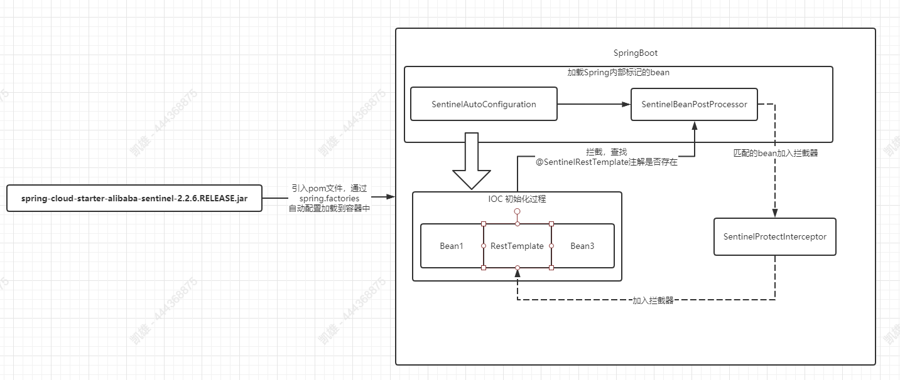

# Sentinel

## 流程梳理

### 1. @SentinelRestTemplate注解的使用

该注解的作用是为初始化RestTemplate的时候植入Sentinel的拦截器，使其对所有请求进行拦截。

**使用方式**

```java
@Bean
@SentinelRestTemplate(fallback = "fallback", fallbackClass = ExceptionUtils.class, blockHandler = "handleException", blockHandlerClass = ExceptionUtils.class)
public RestTemplate restTemplate() {
    SimpleClientHttpRequestFactory simpleClientHttpRequestFactory = new SimpleClientHttpRequestFactory();
    simpleClientHttpRequestFactory.setConnectTimeout(3000);
    simpleClientHttpRequestFactory.setReadTimeout(5000);
    RestTemplate restTemplate = new RestTemplate();
    		restTemplate.setRequestFactory(simpleClientHttpRequestFactory);
    return restTemplate;
}
```

对于该注解的运行过程为:

当pom文件引入spring-cloud-starter-alibaba-sentinel-2.2.6.RELEASE.jar包的时候，内部spring.factories文件会被SpringBoot的SPI机制所发现，并注入关键配置`SentinelAutoConfiguration`，该配置会初始化一个关键的类:`SentinelBeanPostProcessor`


该类实现了Spring中的Bean的处理器,当所有bean在初始化过程中都会交由这些处理器过一遍，SentinelBeanPostProcessor的作用是扫描每个bean是否携带`SentinelRestTemplate`注解，如果携带则植入`SentinelProtectInterceptor`拦截器，这个拦截器中对每个资源进行了Sentinel资源的埋点;

```java
public ClientHttpResponse intercept(HttpRequest request, byte[] body,
			ClientHttpRequestExecution execution) throws IOException {
		URI uri = request.getURI();
		String hostResource = request.getMethod().toString() + ":" + uri.getScheme()
				+ "://" + uri.getHost()
				+ (uri.getPort() == -1 ? "" : ":" + uri.getPort());
		String hostWithPathResource = hostResource + uri.getPath();
		boolean entryWithPath = true;
		if (hostResource.equals(hostWithPathResource)) {
			entryWithPath = false;
		}
		Method urlCleanerMethod = BlockClassRegistry.lookupUrlCleaner(
				sentinelRestTemplate.urlCleanerClass(),
				sentinelRestTemplate.urlCleaner());
		if (urlCleanerMethod != null) {
			hostWithPathResource = (String) methodInvoke(urlCleanerMethod,
					hostWithPathResource);
		}

		Entry hostEntry = null;
		Entry hostWithPathEntry = null;
		ClientHttpResponse response = null;
		try {
			hostEntry = SphU.entry(hostResource, EntryType.OUT);
			if (entryWithPath) {
				hostWithPathEntry = SphU.entry(hostWithPathResource, EntryType.OUT);
			}
			response = execution.execute(request, body);
			if (this.restTemplate.getErrorHandler().hasError(response)) {
				Tracer.trace(
						new IllegalStateException("RestTemplate ErrorHandler has error"));
			}
			return response;
		}
		catch (Throwable e) {
			if (BlockException.isBlockException(e)) {
				return handleBlockException(request, body, execution, (BlockException) e);
			}
			else {
				Tracer.traceEntry(e, hostEntry);
				if (e instanceof IOException) {
					throw (IOException) e;
				}
				else if (e instanceof RuntimeException) {
					throw (RuntimeException) e;
				}
				else {
					throw new IOException(e);
				}
			}
		}
		finally {
			if (hostWithPathEntry != null) {
				hostWithPathEntry.exit();
			}
			if (hostEntry != null) {
				hostEntry.exit();
			}
		}
	}
```

总的流程图如下:




- spring-cloud-starter-alibaba-sentinel-2.2.6.RELEASE.jar
  - SentinelAutoConfiguration
    - SentinelBeanPostProcessor
      - SentinelProtectInterceptor


### 2. 异常页面打印

#### BlockExceptionHandler

实现该接口，一旦触发熔断的返回内容便会触发;具体的实现入口在

`com.alibaba.cloud.sentinel.SentinelWebAutoConfiguration#sentinelWebMvcConfig`

如果IOC容器中能找到BlockExceptionHandler的实现类，那么优先执行这些实现类；

配置前缀: `spring.cloud.sentinel`

- blockPage : 页面路径，如果没有实现BlockExceptionHandler类的话,就以这个路径为目的地
- http-method-specify: false ; 是否加上方法前缀
- web-context-unify: true  是否加上上下文前缀

> http-method-specify和web-context-unify在Sentinel 控制台里面结合簇点链路里面的树状图可以更清晰

