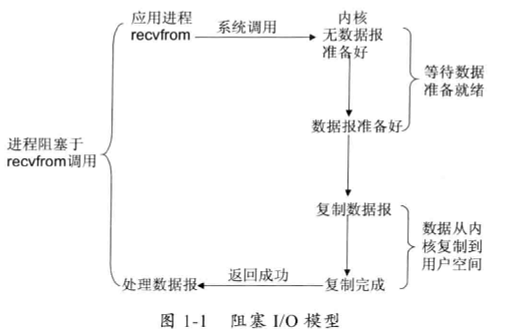

>  https://www.cnblogs.com/binarylei/p/8933516.html 

[TOC]

## 一、基本概念

在正式开始讲 Linux IO 模型前，先介绍 5 个基本概念。

### 1.1 用户空间与内核空间

现在操作系统都是采用虚拟存储器，那么对 32 位操作系统而言，它的寻址空间 (虚拟存储空间)为 4G (2的32次方)。操作系统的核心是内核，独立于普通的应用程序，可以访问受保护的内存空间，也有访问底层硬件设备的所有权限。为了保证用户进程不能直接操作内核 (kernel)，保证内核的安全，**操作系统将虚拟空间划分为两部分，一部分为内核空间，一部分为用户空间。**针对 Linux 操作系统而言，将最高的 1G 字节 (从虚拟地址 0xC0000000 到 0xFFFFFFFF)，供内核使用，称为内核空间，而将较低的3G字节 (从虚拟地址 0x00000000 到 0xBFFFFFFF)，供各个进程使用，称为用户空间。

### 1.2 进程切换

为了控制进程的执行，内核必须有能力挂起正在 CPU 上运行的进程，并恢复以前挂起的某个进程的执行。这种行为被称为进程切换。因此可以说，任何进程都是在操作系统内核的支持下运行的，是与内核紧密相关的。**总之，进程切换很耗资源。**

### 1.3 进程的阻塞

正在执行的进程，由于期待的某些事件未发生，如请求系统资源失败、等待某种操作的完成、新数据尚未到达或无新工作做等，则由系统自动执行阻塞原语(Block)，使自己由运行状态变为阻塞状态。可见，进程的阻塞是进程自身的一种主动行为，也因此只有处于运行态的进程 (获得 CPU)，才可能将其转为阻塞状态。**当进程进入阻塞状态，是不占用 CPU 资源的。**

### 1.4 文件描述符 fd

文件描述符 (File descriptor)是计算机科学中的一个术语，是一个用于表述指向文件的引用的抽象化概念。

文件描述符在形式上是一个非负整数。实际上，它是一个索引值，指向内核为每一个进程所维护的该进程打开文件的记录表。当程序打开一个现有文件或者创建一个新文件时，内核向进程返回一个文件描述符。在程序设计中，一些涉及底层的程序编写往往会围绕着文件描述符展开。但是文件描述符这一概念往往只适用于 UNIX、Linux 这样的操作系统。

**Linux 内核将所有外部设备都看做一个文件来操作，对一个文件的读写操作会调用内核提供的系统命令，返回一个 file descriptor(fd，文件描述符)。而对一个 socket 的读写也会有相应的描述符，称为 socketfd(socket 描述符)**，描述符就是一个数字，它指向内核中的一个结构体(文件路径，数据区等一些属性)。

### 1.5 缓存 IO

缓存 IO 又被称作标准 IO，大多数文件系统的默认 IO 操作都是缓存 IO。在 Linux 的缓存 IO 机制中，操作系统会将 IO 的数据缓存在文件系统的页缓存 (page cache) 中，也就是说，数据会先被拷贝到操作系统内核的缓冲区中，然后才会从操作系统内核的缓冲区拷贝到应用程序的地址空间。

缓存 IO 的缺点：

- 数据在传输过程中需要在应用程序地址空间和内核进行多次数据拷贝操作，这些数据拷贝操作所带来的 CPU 以及内存开销是非常大的。

### 2.1 同步阻塞 IO (blocking IO)

#### (1) 场景描述

我和女友点完餐后，不知道什么时候能做好，只好坐在餐厅里面等，直到做好，然后吃完才离开。女友本想还和我一起逛街的，但是不知道饭能什么时候做好，只好和我一起在餐厅等，而不能去逛街，直到吃完饭才能去逛街，中间等待做饭的时间浪费掉了。这就是典型的阻塞。

#### (2) 网络模型

同步阻塞 IO 模型是最常用的一个模型，也是最简单的模型。在 Linux 中，默认情况下所有的 socket 都是 blocking。它符合人们最常见的思考逻辑。阻塞就是进程 "被" 休息，CPU 处理其它进程去了。

在这个 IO 模型中，用户空间的应用程序执行一个系统调用 (recvform)，这会导致应用程序阻塞，什么也不干，直到数据准备好，并且将数据从内核复制到用户进程，最后进程再处理数据，在等待数据到处理数据的两个阶段，整个进程都被阻塞。不能处理别的网络 IO。调用应用程序处于一种不再消费 CPU 而只是简单等待响应的状态，因此从处理的角度来看，这是非常有效的。在调用 recv()/recvfrom() 函数时，发生在内核中等待数据和复制数据的过程，大致如下图：

#### (3) 流程描述

当用户进程调用了 recv()/recvfrom() 这个系统调用，kernel 就开始了 IO 的第一个阶段：准备数据 (对于网络 IO 来说，很多时候数据在一开始还没有到达。比如，还没有收到一个完整的 UDP 包。这个时候 kernel 就要等待足够的数据到来)。这个过程需要等待，也就是说数据被拷贝到操作系统内核的缓冲区中是需要一个过程的。而在用户进程这边，整个进程会被阻塞 (当然，是进程自己选择的阻塞)。第二个阶段：当 kernel 一直等到数据准备好了，它就会将数据从 kernel 中拷贝到用户内存，然后 kernel 返回结果，用户进程才解除 block 的状态，重新运行起来。

所以，blocking IO 的特点就是在 IO 执行的两个阶段都被 block 了。

优点：

1. 能够及时返回数据，无延迟；
2. 对内核开发者来说这是省事了；

缺点：

1. 对用户来说处于等待就要付出性能的代价了；

### 2.2 同步非阻塞 IO (nonblocking IO)

#### (1) 场景描述

我女友不甘心白白在这等，又想去逛商场，又担心饭好了。所以我们逛一会，回来询问服务员饭好了没有，来来回回好多次，饭都还没吃都快累死了啦。这就是非阻塞。需要不断的询问，是否准备好了。

#### (2) 网络模型

同步非阻塞就是 “每隔一会儿瞄一眼进度条” 的轮询 (polling)方式。在这种模型中，设备是以非阻塞的形式打开的。这意味着 IO 操作不会立即完成，read 操作可能会返回一个错误代码，说明这个命令不能立即满足 (EAGAIN 或 EWOULDBLOCK)。

在网络 IO 时候，非阻塞 IO 也会进行 recvform 系统调用，检查数据是否准备好，与阻塞 IO 不一样，“非阻塞将大的整片时间的阻塞分成 N 多的小的阻塞，所以进程不断地有机会 ‘被’ CPU光顾”。

也就是说非阻塞的 recvform 系统调用之后，进程并没有被阻塞，内核马上返回给进程，如果数据还没准备好，此时会返回一个 error。进程在返回之后，可以干点别的事情，然后再发起 recvform 系统调用。重复上面的过程，循环往复的进行 recvform 系统调用。这个过程通常被称之为轮询。轮询检查内核数据，直到数据准备好，再拷贝数据到进程，进行数据处理。需要注意，拷贝数据整个过程，进程仍然是属于阻塞的状态。

在 Linux 下，可以通过设置 socket 使其变为 non-blocking。当对一个 non-blocking socket 执行读操作时，流程如图所示：

#### (3) 流程描述

当用户进程发出 read 操作时，如果 kernel 中的数据还没有准备好，那么它并不会 block 用户进程，而是立刻返回一个 error。从用户进程角度讲，它发起一个 read 操作后，并不需要等待，而是马上就得到了一个结果。用户进程判断结果是一个 error 时，它就知道数据还没有准备好，于是它可以再次发送 read 操作。一旦 kernel 中的数据准备好了，并且又再次收到了用户进程的 system call，那么它马上就将数据拷贝到了用户内存，然后返回。

所以，nonblocking IO 的特点是用户进程需要不断的主动询问 kernel 数据好了没有。

同步非阻塞方式相比同步阻塞方式：

优点：能够在等待任务完成的时间里干其他活了 (包括提交其他任务，也就是 “后台” 可以有多个任务在同时执行)。

缺点：任务完成的响应延迟增大了，因为每过一段时间才去轮询一次 read 操作，而任务可能在两次轮询之间的任意时间完成。这会导致整体数据吞吐量的降低。

### 2.3 IO 多路复用 (IO multiplexing)

#### (1) 场景描述

与第二个方案差不多，餐厅安装了电子屏幕用来显示点餐的状态，这样我和女友逛街一会，回来就不用去询问服务员了，直接看电子屏幕就可以了。这样每个人的餐是否好了，都直接看电子屏幕就可以了，这就是典型的 IO 多路复用。

#### (2) 网络模型

由于同步非阻塞方式需要不断主动轮询，轮询占据了很大一部分过程，轮询会消耗大量的 CPU 时间，而 “后台” 可能有多个任务在同时进行，人们就想到了循环查询多个任务的完成状态，只要有任何一个任务完成，就去处理它。如果轮询不是用户的进程，而是有人帮忙就好了。这就是所谓的 “IO 多路复用”。UNIX/Linux 下的 select、poll、epoll 就是干这个的 (epoll 比 poll、select 效率高，做的事情是一样的)。

I/O 复用模型会用到 select、poll、epoll 函数，这几个函数也会使进程阻塞。select 调用是内核级别的。

- select 轮询相对非阻塞的轮询的区别在于：select 可以对多个 socket 端口进行监听，当其中任何一个 socket 的数据准好了，就能返回进行可读，然后进程再进行 recvform 系统调用，将数据由内核拷贝到用户进程，当然这个过程是阻塞的
- select 相对 blocking IO 阻塞不同在于：此时的 select 不是等到 socket 数据全部到达再处理，而是有了一部分数据就会调用用户进程来处理。如何知道有一部分数据到达了呢？监视的事情交给了内核，内核负责数据到达的处理。也可以理解为"非阻塞"吧。

对于多路复用，也就是轮询多个 socket。多路复用既然可以处理多个 IO，也就带来了新的问题，多个 IO 之间的顺序变得不确定了，当然也可以针对不同的编号。具体流程，如下图所示：

#### (3) 流程描述

IO multiplexing 就是我们说的 select，poll，epoll，有些地方也称这种 IO 方式为 event driven IO。select/epoll 的好处就在于单个 process 就可以同时处理多个网络连接的 IO。它的基本原理就是 select，poll，epoll 这个 function 会不断的轮询所负责的所有 socket，当某个 socket 有数据到达了，就通知用户进程。

**当用户进程调用了 select，那么整个进程会被 block** ，而同时，kernel 会“监视”所有 select 负责的 socket，当任何一个 socket 中的数据准备好了，select 就会返回。这个时候用户进程再调用 read 操作，将数据从 kernel 拷贝到用户进程。

多路复用的特点是通过一种机制一个进程能同时等待 IO 文件描述符，内核监视这些文件描述符 (套接字描述符)，其中的任意一个进入读就绪状态，select， poll，epoll 函数就可以返回。对于监视的方式，又可以分为 select， poll， epoll 三种方式。

上面的图和 blocking IO 的图其实并没有太大的不同，事实上，还更差一些。 **因为这里需要使用两个 system call (select 和 recvfrom)，而 blocking IO 只调用了一个 system call (recvfrom)。但是，用 select 的优势在于它可以同时处理多个 connection。**

所以，如果处理的连接数不是很高的话，使用 select/epoll 的 web server 不一定比使用 multi-threading + blocking IO 的 web server 性能更好，可能延迟还更大。select/epoll 的优势并不是对于单个连接能处理得更快，而是在于能处理更多的连接。

在 IO multiplexing Model 中，实际中，对于每一个 socket，一般都设置成为 non-blocking，但是，如上图所示，整个用户的 process 其实是一直被 block 的。只不过 process 是被 select 这个函数 block，而不是被 socket IO 给 block。所以 IO 多路复用是阻塞在 select，epoll 这样的系统调用之上，而没有阻塞在真正的 I/O 系统调用如 recvfrom 之上。

了解了前面三种 IO 模式，在用户进程进行系统调用的时候，他们在等待数据到来的时候，处理的方式不一样，直接等待，轮询，select 或 poll 轮询，两个阶段过程：

- 第一个阶段有的阻塞，有的不阻塞，有的可以阻塞又可以不阻塞。
- 第二个阶段都是阻塞的。

从整个 IO 过程来看，他们都是顺序执行的，因此可以归为同步模型(synchronous)。都是进程主动等待且向内核检查状态。【此句很重要！！！】

高并发的程序一般使用同步非阻塞方式，而非多线程+同步阻塞方式。要理解这一点，首先要扯到并发和并行的区别。<u>**比如去某部门办事需要依次去几个窗口，办事大厅里的人数就是并发数，而窗口个数就是并行度。**</u>也就是说并发数是指同时进行的任务数 (如同时服务的 HTTP 请求)，而并行数是可以同时工作的物理资源数量 (如 CPU 核数)。通过合理调度任务的不同阶段，并发数可以远远大于并行度，这就是区区几个 CPU 可以支持上万个用户并发请求的奥秘。在这种高并发的情况下，为每个任务 (用户请求)创建一个进程或线程的开销非常大。而同步非阻塞方式可以把多个 IO 请求丢到后台去，这就可以在一个进程里服务大量的并发 IO 请求。

注意：IO 多路复用是同步阻塞模型还是异步阻塞模型，在此给大家分析下：

同步是需要主动等待消息通知，而异步则是被动接收消息通知，通过回调、通知、状态等方式来被动获取消息。IO 多路复用在阻塞到 select 阶段时，用户进程是主动等待并调用 select 函数获取数据就绪状态消息，并且其进程状态为阻塞。所以，把 IO 多路复用归为同步阻塞模式。

### 2.4 信号驱动式IO (signal-driven IO)

信号驱动式 I/O：首先我们允许 Socket 进行信号驱动 IO，并安装一个信号处理函数，进程继续运行并不阻塞。当数据准备好时，进程会收到一个 SIGIO 信号，可以在信号处理函数中调用 I/O 操作函数处理数据。过程如下图所示：

### 2.5 异步非阻塞 IO (asynchronous IO)

#### (1) 场景描述

女友不想逛街，又餐厅太吵了，回家好好休息一下。于是我们叫外卖，打个电话点餐，然后我和女友可以在家好好休息一下，饭好了送货员送到家里来。这就是典型的异步，只需要打个电话说一下，然后可以做自己的事情，饭好了就送来了。

#### (2) 网络模型

相对于同步 IO，异步 IO 不是顺序执行。用户进程进行 aio_read 系统调用之后，无论内核数据是否准备好，都会直接返回给用户进程，然后用户态进程可以去做别的事情。等到 socket 数据准备好了，内核直接复制数据给进程，然后从内核向进程发送通知。IO 两个阶段，进程都是非阻塞的。

Linux 提供了 AIO 库函数实现异步，但是用的很少。目前有很多开源的异步 IO 库，例如 libevent、libev、libuv。异步过程如下图所示：

#### (3) 流程描述

用户进程发起 aio_read 操作之后，立刻就可以开始去做其它的事。而另一方面，从 kernel 的角度，当它受到一个 asynchronous read 之后， **首先它会立刻返回，所以不会对用户进程产生任何 block** 。然后，kernel 会等待数据准备完成，然后将数据拷贝到用户内存， **当这一切都完成之后，kernel 会给用户进程发送一个 signal 或执行一个基于线程的回调函数来完成这次 IO 处理过程** ，告诉它 read 操作完成了。

在 Linux 中，通知的方式是 “信号”：

- 如果这个进程正在用户态忙着做别的事 (例如在计算两个矩阵的乘积)，那就强行打断之，调用事先注册的信号处理函数，这个函数可以决定何时以及如何处理这个异步任务。由于信号处理函数是突然闯进来的，因此跟中断处理程序一样，有很多事情是不能做的，因此保险起见，一般是把事件 “登记” 一下放进队列，然后返回该进程原来在做的事。
- 如果这个进程正在内核态忙着做别的事，例如以同步阻塞方式读写磁盘，那就只好把这个通知挂起来了，等到内核态的事情忙完了，快要回到用户态的时候，再触发信号通知。
- 如果这个进程现在被挂起了，例如无事可做 sleep 了，那就把这个进程唤醒，下次有 CPU 空闲的时候，就会调度到这个进程，触发信号通知。

异步 API 说来轻巧，做来难，这主要是对 API 的实现者而言的。Linux 的异步 IO (AIO)支持是 2.6.22 才引入的，还有很多系统调用不支持异步 IO。Linux 的异步 IO 最初是为数据库设计的，因此通过异步 IO 的读写操作不会被缓存或缓冲，这就无法利用操作系统的缓存与缓冲机制。

很多人把 Linux 的 O_NONBLOCK 认为是异步方式，但事实上这是前面讲的同步非阻塞方式。需要指出的是，虽然 Linux 上的 IO API 略显粗糙，但每种编程框架都有封装好的异步 IO 实现。操作系统少做事，把更多的自由留给用户，正是 UNIX 的设计哲学，也是 Linux 上编程框架百花齐放的一个原因。

从前面 IO 模型的分类中，我们可以看出 AIO 的动机：

- 同步阻塞模型需要在 IO 操作开始时阻塞应用程序。这意味着不可能同时重叠进行处理和 IO 操作。
- 同步非阻塞模型允许处理和 IO 操作重叠进行，但是这需要应用程序根据重现的规则来检查 IO 操作的状态。
- 这样就剩下异步非阻塞 IO 了，它允许处理和 IO 操作重叠进行，包括 IO 操作完成的通知。

IO 多路复用除了需要阻塞之外，select 函数所提供的功能 (异步阻塞 IO)与 AIO 类似。不过，它是对通知事件进行阻塞，而不是对 IO 调用进行阻塞。

### 2.6 关于异步阻塞

有时我们的 API 只提供异步通知方式，例如在 node.js 里，但业务逻辑需要的是做完一件事后做另一件事，例如数据库连接初始化后才能开始接受用户的 HTTP 请求。这样的业务逻辑就需要调用者是以阻塞方式来工作。

为了在异步环境里模拟 “顺序执行” 的效果，就需要把同步代码转换成异步形式，这称为 CPS (Continuation Passing Style)变换。BYVoid 大神的 continuation.js 库就是一个 CPS 变换的工具。用户只需用比较符合人类常理的同步方式书写代码，CPS 变换器会把它转换成层层嵌套的异步回调形式。