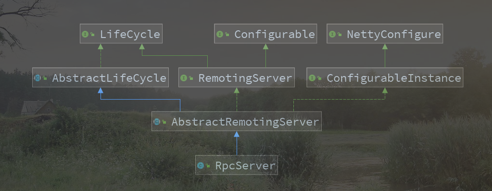
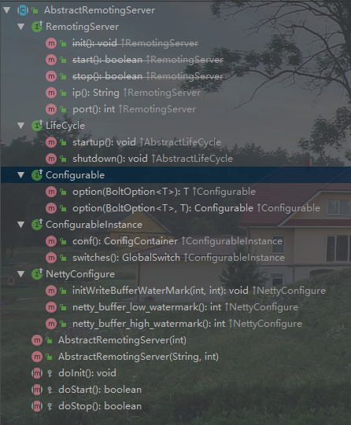
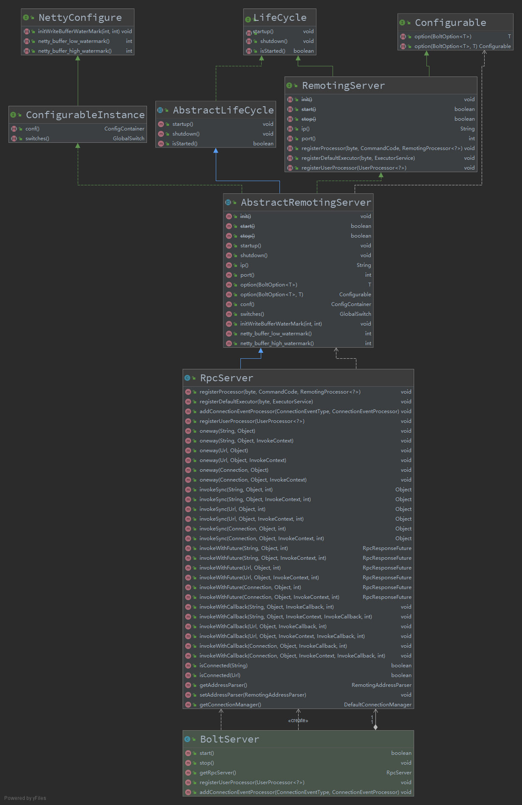

# Sofa-bolt

SOFABolt 是蚂蚁金融服务集团开发的一套基于 Netty 实现的网络通信框架。

- 为了让 Java 程序员能将更多的精力放在基于网络通信的业务逻辑实现上，而不是过多的纠结于网络底层 NIO 的实现以及处理难以调试的网络问题，Netty 应运而生。
- 为了让中间件开发者能将更多的精力放在产品功能特性实现上，而不是重复地一遍遍制造通信框架的轮子，SOFABolt 应运而生。

Bolt 名字取自迪士尼动画-闪电狗，是一个基于 Netty 最佳实践的轻量、易用、高性能、易扩展的通信框架。 这些年我们在微服务与消息中间件在网络通信上解决过很多问题，积累了很多经验，并持续的进行着优化和完善，我们希望能把总结出的解决方案沉淀到 SOFABolt 这个基础组件里，让更多的使用网络通信的场景能够统一受益。 目前该产品已经运用在了蚂蚁中间件的微服务 ([SOFARPC](https://github.com/sofastack/sofa-rpc))、消息中心、分布式事务、分布式开关、以及配置中心等众多产品上。

源码地址 : https://github.com/sofastack/sofa-bolt

项目文档 : https://www.sofastack.tech/projects/sofa-bolt/overview/


> 我们这里的目标是了解他是如何基于Netty去做这样一个东西的。
>
> 他是如何去设计这样一个模型的。

## 开始

1. 下载该项目源码

2. 到该项目的测试用例中查找对应的启动方式


### 测试用例

`com.alipay.remoting.demo` : 这里描述了最简单的启动方式以及简单的调用。

## Server 服务启动

### 架构

目标类 : RpcServerDemoByMain

具体的启动模版代码 : 

```java
public RpcServerDemoByMain() {
        // 1. 创建一个PPC的服务端.
        server = new BoltServer(port);
        // 2. 添加连接和关闭的执行器到服务端
        server.addConnectionEventProcessor(ConnectionEventType.CONNECT, serverConnectProcessor);
        server.addConnectionEventProcessor(ConnectionEventType.CLOSE, serverDisConnectProcessor);
        // 3. 注册用户的执行器
        server.registerUserProcessor(serverUserProcessor);
        // 4. 服务端的启动
        if (server.start()) {
            System.out.println("server start ok!");
        } else {
            System.out.println("server start failed!");
        }
        // server.getRpcServer().stop();
    }
```

一共几个步骤 : 

- 构建服务端
- 加入一些相关的执行器事件，这些执行事件（连接、关闭、业务处理）会在运行时被回调。
- 启动服务端，Netty的具体构建实现

我们这里在看一下服务端的类模型: 

BoltServer: 具体的门面，里面持有具体的服务端，以及端口的植入

- port : 用户指定端口
- RpcServer : 具体的启动服务


RpcServer的类结构: 






AbstractRemotingServer : 抽象的远程服务

- 该类有三个抽象方法，需要被子类给实现

  - doInit : 初始化方法
  - doStart : 启动服务的方法
  - doStop : 停止服务的方法

  > 这里的目的是让子类去实现服务端的具体实现，可以用Netty也可以用其他的，

其他的接口作用，从上图也可以发现端倪：

- RemotingServer : 定义服务的IP和端口
- LifeCycle - AbstractLifeCycle: 启动和停止容器，里面会有一个标记，这个标记记录了是否启动和停止
- Configurable : 配置项定义
- ConfigurableInstance : 配置定义，以及切换
- NettyConfigure : netty的缓冲配置

这里回顾一下这个抽象类一共具备哪些功能: 

1. 启动和停止服务
2. 本地的ip和端口
3. 基于Netty的配置项
4. 缓冲区的配置
5. 配置项的切换[客户端\服务端\监控]

子类 RpcServer 的实现



- 实现了服务类的服务初始化。

- 注册执行器的能力

> 这时候一个服务单的架子基本上搭好了，能启动服务，配置定义，以及缓冲区的定义等等，还能注册执行器。


### 初始化细节

具体的启动模版在父类AbstractRemotingServer的startup方法中。

- 调用父类的startup方法,这个方法只是为了告诉AbstractLifeCycle我要启动了，让父类记录一下。
- doInit : 这里才是构建Netty的具体实现

```java
@Override
public void startup() throws LifeCycleException {
    // 告诉父类准备启动了,让它记录一下
    super.startup();
    // 具体Netty初始化构建
    doInit();
    // 启动netty服务
    doStart();
    ... 省略非关键代码
}
```

RpcServer

```java
protected void doInit() {
    if (this.addressParser == null) {
        // 构建一个地址解析器
        this.addressParser = new RpcAddressParser();
    }
    
    if (this.switches().isOn(GlobalSwitch.SERVER_MANAGE_CONNECTION_SWITCH)) {
        // in server side, do not care the connection service state, so use null instead of global switch
        ConnectionSelectStrategy connectionSelectStrategy = new RandomSelectStrategy(null);
        this.connectionManager = new DefaultServerConnectionManager(connectionSelectStrategy);
        this.connectionManager.startup();

        this.connectionEventHandler = new RpcConnectionEventHandler(switches());
        this.connectionEventHandler.setConnectionManager(this.connectionManager);
        this.connectionEventHandler.setConnectionEventListener(this.connectionEventListener);
    } else {
        // 构建一个事件处理handler
        this.connectionEventHandler = new ConnectionEventHandler(switches());
        // 构建线程池监听这个handle事件
        this.connectionEventHandler.setConnectionEventListener(this.connectionEventListener);
    }
    // 初始化RPC的远程的基础配置 / encode、decode
    initRpcRemoting();
    this.bootstrap = new ServerBootstrap();
    this.bootstrap.group(bossGroup, workerGroup)
        .channel(NettyEventLoopUtil.getServerSocketChannelClass())
        .option(ChannelOption.SO_BACKLOG, ConfigManager.tcp_so_backlog())
        .option(ChannelOption.SO_REUSEADDR, ConfigManager.tcp_so_reuseaddr())
        .childOption(ChannelOption.TCP_NODELAY, ConfigManager.tcp_nodelay())
        .childOption(ChannelOption.SO_KEEPALIVE, ConfigManager.tcp_so_keepalive());

    // set write buffer water mark
    initWriteBufferWaterMark();

    // init byte buf allocator
    if (ConfigManager.netty_buffer_pooled()) {
        this.bootstrap.option(ChannelOption.ALLOCATOR, PooledByteBufAllocator.DEFAULT)
            .childOption(ChannelOption.ALLOCATOR, PooledByteBufAllocator.DEFAULT);
    } else {
        this.bootstrap.option(ChannelOption.ALLOCATOR, UnpooledByteBufAllocator.DEFAULT)
            .childOption(ChannelOption.ALLOCATOR, UnpooledByteBufAllocator.DEFAULT);
    }

    // enable trigger mode for epoll if need
    NettyEventLoopUtil.enableTriggeredMode(bootstrap);

    final boolean idleSwitch = ConfigManager.tcp_idle_switch();
    final int idleTime = ConfigManager.tcp_server_idle();
    final ChannelHandler serverIdleHandler = new ServerIdleHandler();
    final RpcHandler rpcHandler = new RpcHandler(true, this.userProcessors);
    this.bootstrap.childHandler(new ChannelInitializer<SocketChannel>() {

        @Override
        protected void initChannel(SocketChannel channel) {
            ChannelPipeline pipeline = channel.pipeline();
            pipeline.addLast("decoder", codec.newDecoder());
            pipeline.addLast("encoder", codec.newEncoder());
            if (idleSwitch) {
                pipeline.addLast("idleStateHandler", new IdleStateHandler(0, 0, idleTime,
                                                                          TimeUnit.MILLISECONDS));
                pipeline.addLast("serverIdleHandler", serverIdleHandler);
            }
            pipeline.addLast("connectionEventHandler", connectionEventHandler);
            pipeline.addLast("handler", rpcHandler);
            createConnection(channel);
        }

        /**
             * create connection operation<br>
             * <ul>
             * <li>If flag manageConnection be true, use {@link DefaultConnectionManager} to add a new connection, meanwhile bind it with the channel.</li>
             * <li>If flag manageConnection be false, just create a new connection and bind it with the channel.</li>
             * </ul>
             */
        private void createConnection(SocketChannel channel) {
            Url url = addressParser.parse(RemotingUtil.parseRemoteAddress(channel));
            if (switches().isOn(GlobalSwitch.SERVER_MANAGE_CONNECTION_SWITCH)) {
                connectionManager.add(new Connection(channel, url), url.getUniqueKey());
            } else {
                new Connection(channel, url);
            }
            channel.pipeline().fireUserEventTriggered(ConnectionEventType.CONNECT);
        }
    });
}
```

**initRpcRemoting :**  这个方法很关键，初始化服务的公共设施 - 编解码


- 初始化RpcServerRemoting类
  - 触发父类RpcRemoting的静态方法块
    - 执行RpcProtocolManager.initProtocols()方法
      - 将系统的协议类都注册到ProtocolManager的容器中进行管理

> 至此所有的协议封装都在ProtocolManager单例容器Map中了

**RpcProtocolManager.initProtocols()**

- 注册协议

  - RpcProtocol

    - RpcCommandEncoder
    - RpcCommandDecoder
    - RpcCommandFactory
    - RpcHeartbeatTrigger
    - RpcCommandHandler
      - RpcRequestProcessor
      - RpcResponseProcessor
      - RpcHeartBeatProcessor

  - RpcProtocolV2

    - RpcCommandEncoderV2
    - RpcCommandDecoderV2
    - RpcCommandFactory
    - RpcHeartbeatTrigger
    - RpcCommandHandler

    