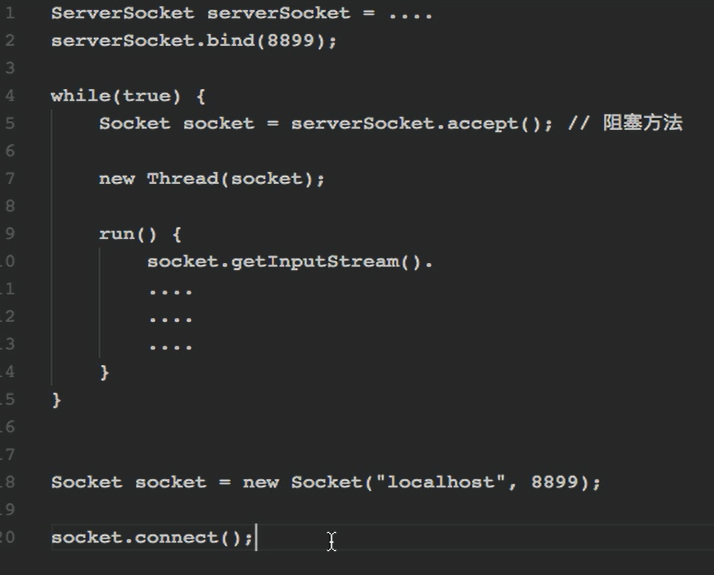
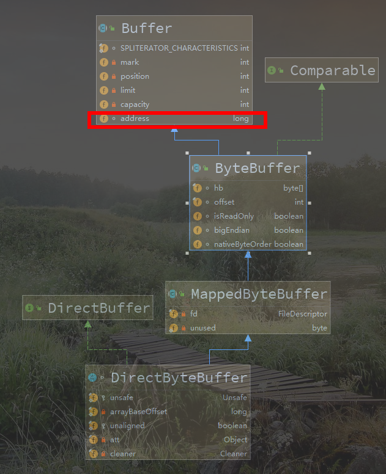
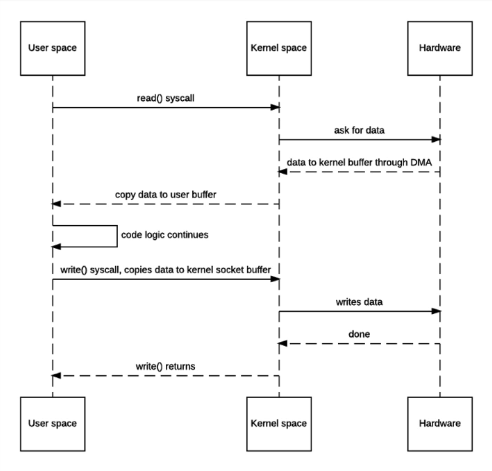
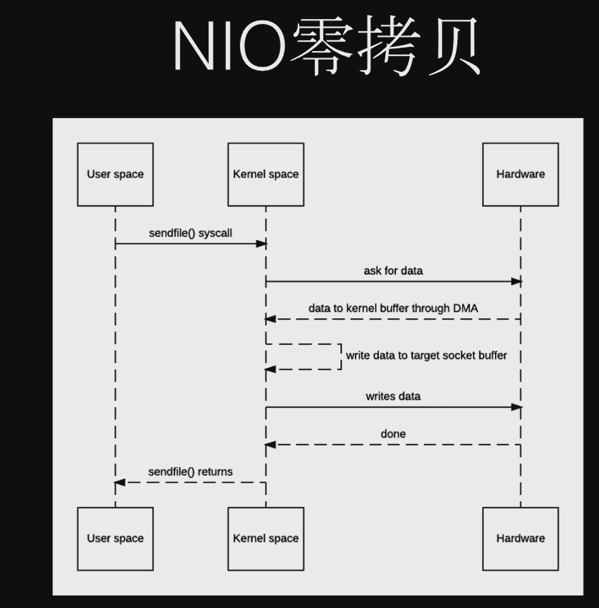
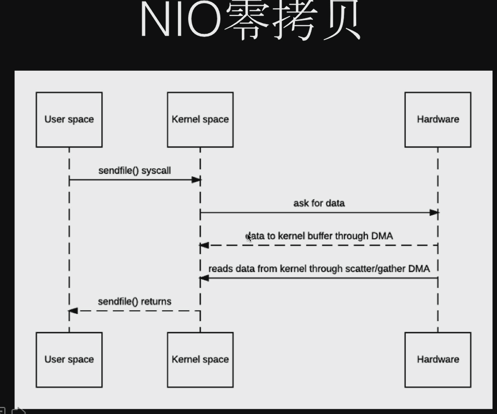
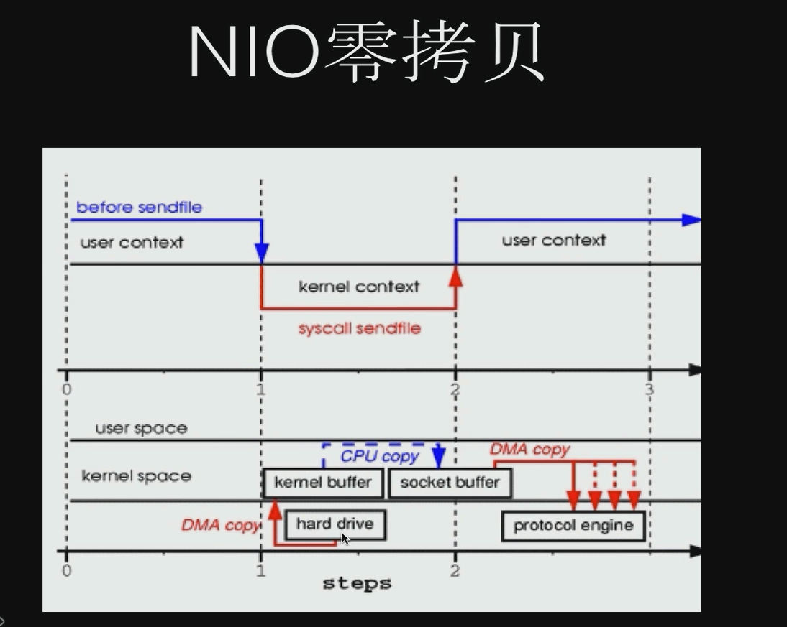
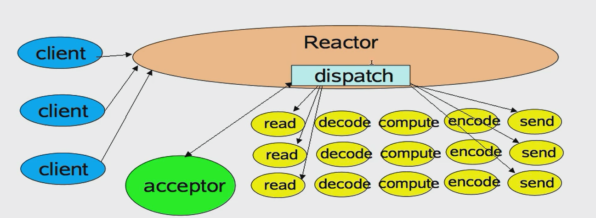
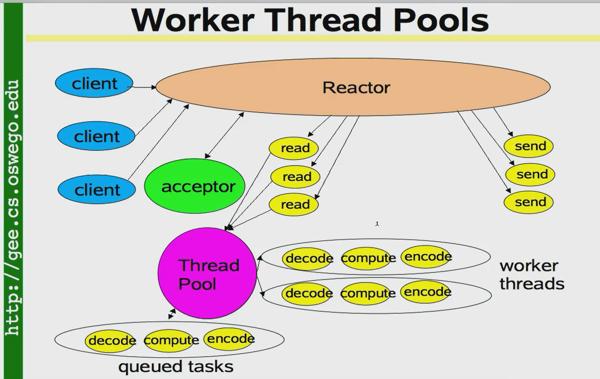
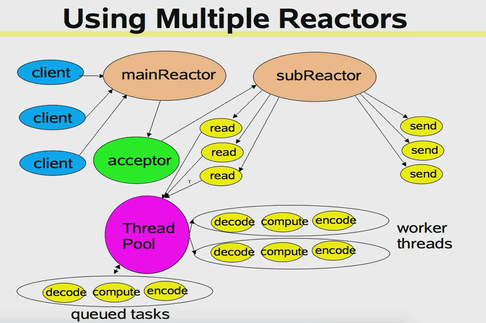
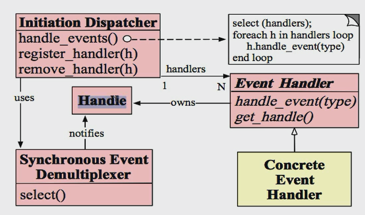

## Java IO 演进之路

### I/O基础

1. 同步阻塞IO通信模型

   

   1. 门卫的案例(所有请求交给门卫，由门卫再分发给其他客户。)
      1. 读取数据
      2. 解码
      3. 执行业务操作
      4. 编码
      5. 发送回客户端

   **模型缺点：**
       1）服务端线程个数与客户端并发访问连接数是1：1的关系；
       2）随着客户端并发访问量增大，服务端线程个数线性膨胀，系统性能急剧下降。

2. M:N形式的同步阻塞IO通讯模型[BIO]

   

   **模型缺点**:

   - BIO的读和写操作都是同步阻塞的，阻塞时间取决于对端IO线程的处理速度和网络IO的传输速度，可靠性差；

   - 当线程池中所有线程都因对端IO线程处理速度慢导致阻塞时，所有后续接入的客户端连接请求都将在任务队列中排队阻塞堆积；
   - 任务队列堆积满后，新的客户端连接请求将被服务端单线程Acceptor阻塞或拒绝，客户端会发生大量连接失败和连接超时。

   **linux的内核模型**

   

   等待数据准备 -> 等待数据复制  [内核空间 -> 用户空间]

1. 单线程NIO 


瓶颈会出现在**acceptor**。

acceptor : 接收器

reactor : 事件模型。


**模型优缺点**
    a. 单线程版本Reactor模型优点是不需要做并发控制，代码实现简单清晰；
    b. 缺点是**不能利用多核CPU**，一个线程需要执行处理所有的**accept、read、decode、process、encode、send事件**，如果其中decode、process、encode事件的处理很耗时，则服务端无法及时响应其他客户端的请求事件。

##### 多线程NIO


可能会遇到的问题:

1. 线程如何分配合理?


**模型缺点：**
    a. 因为Reactor仍是单线程，无法并行响应多个客户端的请求事件（比如同一时刻只能read一个客户端的请求数据）
    

### 同步和异步的差别

同步IO和异步IO区别在于: 数据访问的时候进程是否阻塞!

- 跑到印刷店印书,你没付钱，所以要一直等在这里 - 同步
- 打电话，告诉他需求，然后做自己的事情。 - 异步

阻塞IO和非阻塞IO的区别在于: 应用程序的调用是否立即返回!

- 烧水
  - 阻塞 : 一直盯着开水机，直到开了为止
  - 非阻塞: 水壶开了自己叫，不用人一直等。


### NIO概述

#### 什么是NIO?

同步非阻塞模型


#### 内核空间和用户空间

堆内存/

#### 内核缓冲与进程缓冲


#### 同步与异步


#### 阻塞与非阻塞


### Linux网络模型


### Java IO演进

### BIO 

#### **ServerSocket**

管道流


## Netty入门

### 什么是Netty ? 

- 异步事件驱动框架，用于快速开发高i性能服务端和客户端
- 封装了JDK底层BIO和NIO模型，提供高度可用的API
- 自带编码解码器解决拆包粘包问题，用户只用关心业务逻辑
- 精心设计的Reactor线程模型支持高并发海量连接
  - 支持高并发非常有效
- 自带协议栈，无需用户关心 
  - 已经实现了大多数协议，用户可以自定义协议


### Netty的三个核心概念

- Selector : 选择器,基于事件选择channel
- Channel : 类似每个客户端连接
  - Channel是双向的，既能往里面读，也能往里面写。 
- Buffer : 数据传输的载体

#### selector

传统的连接建立: 



描述 : 

- accept负责阻塞请求，等待客户端发送过来的请求
- 一旦获取到连接便交给了新线程处理

**问题** : 每个客户对应一个新线程，如果并发过大，导致服务器要创建大量的线程，而线程资源本身很宝贵，耗时。

> 考虑使用线程池，至少省略了创建和关闭线程的操作。

SelectorKey : 

- OP_ACCEPT
- OP_CONNECT
- OP_READ
- OP_WRITE

默认的Selector处理类 : DefaultSelectorProvider


### 第一个Demo


### 核心组件介绍


### Netty VS Nio


## 项目案例

### 手写推送系统

## Netty源码分析


### 线程模型


### IO模型


### Eventloop


### channel

##### 类

1. ServerSocketChannel
2. SocketChannel
3. DatagramChannel
4. FileChannel

##### 方法

1. transferFrom  从哪里读?

读取数据

2. transferTo  读到哪里去

写入数据

### channelhandler


### pipeline


### 内存分配


### ByteBuffer

1. capacity : 容量 ， 规定**可读和可写**的最大容量，不可变的。
2. position : 位置，下一个既可能是读也可能是写的位置。永远不可能超过limit。
3. limit : 大小 : 指position可以读写的范围大小
4. mark : 重复读标记

rewind : 重复读方法

flip : 翻转方法，将读的位置设置成开始。

- limit : 将指向写position的位置

- Position:指向读的最开始的索引。 

**案例**

```java
public static void main(String[] args) throws Exception {
    // 读取文件中的内容
    FileInputStream inputStream = new FileInputStream("input.txt");
    // 写入文件的对象
    FileOutputStream outputStream = new FileOutputStream("output.txt");

    FileChannel inputChannel = inputStream.getChannel();
    FileChannel outputChannel = outputStream.getChannel();
	// capacity = 512 
    ByteBuffer buffer = ByteBuffer.allocate(512);
	
    while (true) {
        buffer.clear(); // 如果这行代码注释掉? ?
        /**
             *
             * 假设第一次读的大小是13
             *  这时候的坐标 : P = 13 L = 13 C = 512
             *  经过一次flip之后 : P = 0 ; L = 13 ; C =512
             *  然后 write 之后 : P =13 ; L = 13 ; C =512
             * 第二个循环开始 :
             *  没有clear方法? P = 13 ; L =13 ;C = 512 这时候read是写不进去的！所以返回0，因为 P = L；
             *      然后回到上面的flip方法，其实这次没有读到文件的内容，而是残留在第一次读取的文件内容。所以无限循环的写。因为永远read不进去
             *  如果有clear方法 ： P = 0 ; L = C ; C = 512;
             *      这时候read是可以写东西进去的，写满了之后在经过flip方法再往文件里面写下一部分的内容。直到返回-1 文件读取完成了.
             *   * 第三个循环...
             */
        int read = inputChannel.read(buffer);
        System.out.println(" read : " + read);
        if (-1 == read) {
            break;
        }
        buffer.flip();
        outputChannel.write(buffer);
    }
    inputChannel.close();
    outputChannel.close();
}
```

**直接缓冲**

- 非直接缓冲区(HeapByteBuffer)：在 JVM 内存上分配一个字节数组 byte[] hb
- 直接缓冲区(DirectByteBuffer)：保存一个指向系统内核的地址 long address

```java
ByteBuffer.allocateDirect // 称之为直接缓冲
ByteBuffer.allocate // 间接缓冲 使用的都是纯粹的java对象，使用的都是java的字节数组。在堆上,属于java管控

FileChannel inChannel = FileChannel.open(Paths.get("1.png"), StandardOpenOption.READ);
FileChannel outChannel = FileChannel.open(Paths.get("3.png"),
        StandardOpenOption.WRITE, StandardOpenOption.READ, StandardOpenOption.CREATE);

// 方式一：内存映射文件，直接缓冲区
MappedByteBuffer inMappedBuf = inChannel.map(FileChannel.MapMode.READ_ONLY, 0, inChannel.size());
//只有 READ_WRITE，没有 WRITE，因此 outChannel 也要加上 READ
MappedByteBuffer outMappedBuf = outChannel.map(FileChannel.MapMode.READ_WRITE, 0, inChannel.size());

byte[] bytes = new byte[inMappedBuf.limit()];
inMappedBuf.get(bytes);
outMappedBuf.put(bytes);

// 方式二：transferTo 也是使用直接缓冲区
//inChannel.transferTo(0, inChannel.size(), outChannel);
//outChannel.transferFrom(inChannel, 0, inChannel.size());
```

两部分构成:

- JVM 操纵的内容。称之为DirectByteBuffer，位于内存模型中的堆区域。
- 通过Unsafe方法操纵C去操作操作系统内存。属于堆外内存。但是两者需要关联的话，必须有一个关联关系。
  - 

从这个图可以看到关联关系就是通过Buffer的**address**的变量，表示堆外的内存的地址。通过地址就能找到在堆外生成的数据。

如果使用HeadByteBuffer，IO操作的时候，会多一步数据拷贝过程。

如果是DirectByteBuffer的话，会少一步操作到堆上的过程，直接到系统内存中。称之为零拷贝。

#### 1.2 IO 两个流程 ( 零拷贝)

网络 IO 的本质是 socket 的读取，socket 在 linux 系统被抽象为流，IO 可以理解为对流的操作。刚才说了，对于一次 IO 访问 (以 read 举例)，数据会先被拷贝到操作**系统内核的缓冲区中**，然后才会从**操作系统内核的缓冲区拷贝到应用程序的地址空间**。所以说，当一个 read 操作发生时，它会经历两个阶段：

- 第一阶段：等待网络上的数据分组到达，然后被复制到内核的某个缓冲区 (Waiting for the data to be ready)。
- 第二阶段：把数据从内核缓冲区复制到应用进程缓冲区 (Copying the data from the kernel to the process)。

> 摘自 : https://www.cnblogs.com/binarylei/p/10053084.html



图解: 

- 读取操作
  - 用户空间 -> 内核空间 read 
  - 内核空间 发送读取数据的操作 磁盘 .
  - 磁盘数据文件读取(拷贝)到内核空间的缓冲区 [第一次拷贝]
  - 内核空间又需要拷贝到用户空间的缓冲区当中 [第二次拷贝]
- 写操作
  - 用户空间将数据写到内核空间
  - 内核空间再写入到网络当中



图解 : 相较于上一部，用户空间发送的是sendfile操作，所有操作都是基于内核空间，用户空间只需要发送指令和接收接口，少了拷贝到用户空间的操作。

- 读操作
  - 用户空间发送一个sendfile指令操作内核空间
  - 内核空间操作磁盘
  - 磁盘拷贝到内核空间的缓冲区
  - 内核就直接将缓冲区和对端Socket进行传输。

在上一种方案中是将页缓存的数据拷贝到 socket 缓存中，实际上，我们仅仅需要把缓冲区描述符传到 socket 缓冲区，再把数据长度传过去，这样 DMA 控制器直接将页缓存中的数据打包发送到网络中就可以了。不过这种**收集拷贝功能是需要硬件以及驱动程序支持的。**





在服务端响应客户端的场景中，如果使用非直接缓冲区第一步就需要将响应的数据从 JVM 内存拷贝到系统内核中再发送，而使用直接缓冲区就可以省略这个步骤，这就是**零拷贝**。


Linux 的 I/O 操作默认是缓冲 I/O。使用了 read 和 write 两个系统调用，我们并不知道操作系统在其中做了什么。实际上在以上 I/O 操作中，发生了多次的数据拷贝。

当应用程序访问某块数据时，操作系统首先会检查，是不是最近访问过此文件，文件内容是否缓存在内核缓冲区，如果是，操作系统则直接根据 read 系统调用提供的 buf 地址，将内核缓冲区的内容拷贝到 buf 所指定的用户空间缓冲区中去。如果不是，操作系统则首先将磁盘上的数据拷贝的内核缓冲区，这一步目前主要依靠 DMA 来传输，然后再把内核缓冲区上的内容拷贝到用户缓冲区中。
接下来，write 系统调用再把用户缓冲区的内容拷贝到网络堆栈相关的内核缓冲区中，最后 socket 再把内核缓冲区的内容发送到网卡上。

在此过程中，我们没有对文件内容做任何修改，那么在内核空间和用户空间来回拷贝数据无疑就是一种浪费，而零拷贝主要就是为了解决这种低效性。




DMA Copy : 直接内存访问复制

Socket套接字 描述符 : 利用底层的收集操作。

文件描述符 : 

1. 内存地址位置信息
2. 数据的长度


Gather

以前是将磁盘的文件读到内核缓冲区中，现在只是将文件描述符读到sokcet中。

协议引擎发送数据的时候，会将磁盘文件读到内核缓冲区中，而对应的文件描述符读到socket buffer当中。

这时候不必将内核缓冲区文件拷贝到socket中再发送。

**总结**

1. Netty的接受和发送byteBuffer采用 Direct Buffer，使用堆外内存进行Socket读写,不需要进行字节缓冲区的二次拷贝。如果传统的堆内存进行Socket读写会将堆内存拷贝一份到直接内存中，然后再写入Socket中.相比于堆外直接内存,消息在发送过程中多了一次缓存拷贝。
2. Netty提供了CompositeByteBuf类，他可以将多个ByteBuf合并为一个逻辑上的ByteBuf，避免了传统通过内存拷贝的方式将几个小buffer合并成一个大的Buffer
3. 通过FileRegion包装的FileChannel.tranferTo方法实现文件传输，可以直接将文件缓冲区的数据发送到目标Channel，避免了通过循环write方式导致的内存拷贝问题.
4. 通过wrap操作，我们可以将byte数组、ByteBuf、ByteBuffer等包装成一个Netty的ByteBuf对象，进而避免了拷贝操作。

**通过零拷贝实现的几种方式**

1. 直接缓冲区的应用

2. CompositeByteBuf

   ```java
   //定义两个ByteBuf类型的 body 和 header 
   CompositeByteBuf compositeByteBuf = Unpooled.compositeBuffer();
   compositeByteBuf.addComponents(true, header, body);
   ```

   

3. 通过 FileRegion 实现零拷贝

   ```java
   srcFileChannel.transferTo(position, count, destFileChannel);
   ```

   

4. 通过 wrap / slice 实现零拷贝

   ```java
   // wrappedBuffer 和 slice 都是共享同一内存，并没有拷贝
   ByteBuf byteBuf = Unpooled.wrappedBuffer(bytes);
   
   ByteBuf header = byteBuf.slice(0, 5);
   ByteBuf body = byteBuf.slice(5, 10);
   ```

   

> 参考 : https://www.cnblogs.com/binarylei/p/10117437.html


### 编解码


## Reactor 模型

响应式设计：

### 单线程设计



缺点 : 如果黄色部分线程处理过多会拖慢reactor线程。

### 多线程设计




描述：

- 通过线程池来来规划管理。
  - 读写阻塞的单独用线程处理
  - 解码、处理、编码作为一组线程处理

缺点： 读写如果操作过慢，也会导致其他受影响、

### reactor模型



主子线程负责调度



 **模式的角色构成**:

1. Handler((windows)句柄或是(linux)描述符) : 本质上表示一种资源，由操作系统提供的；该资源用于表示一个个的事件，比如文件描述符，或是针对网络编程中的socket描述符。事件即可以来自于外部，也可以来自于内部；外部事件比如说客户端的连接请求，客户端发送数据等；内部事件比如说操作系统产生的定时器事件等。它本质上就是一个文件描述符。Handler本身就是事件发源地。
2. Synchronized Event Demultiplexer (同步事件分离器) : 它本身是一个系统调用，用于等待事件的发生（事件可以是一个 ，也可能是多个）。调用方在调用它的时候会被阻塞，一直阻塞到同步事件分离器上有事件产生为止。对于Linux来说，同步事件分离器值得就是常用的I/O多路复用机制，比如select、poll、epoll等。在Java NIO领域中，同步事件分离器对应的组件就是selector；对应的阻塞方法就是select方法
3. Event Handler (事件处理器) : 本身由多个回调方法构成，这些回调方法构成了与应用相关的对于某个事件的反馈机制。Netty相比于Java NIO来说，在事件处理器这个角色上进行了一个升级，它为我们开发者提供了大量的回调方法，供我们在特定事件产生时实现相应的回调方法进行业务逻辑的处理。
4. Concrete Event Handler (具体事件处理器) : 是事件处理器的实现。它本身实现了事件处理器所提供的各个回调方法，从而实现特定业务的逻辑。它本质上就是我们所编写的一个个的处理器实现。[**相当于我们使用Netty中使用的一个个handler**]
5. Initiation Dispatcher(初始分发器) : 实际上就是Reactor角色。它本身定义了一些规范，这些规范用于控制事件的调度方式，同时又提供了应用进行事件处理器的注册、删除等设施。它本身是整个事件处理器的核心所在，Initiation Dispatcher 会通过同步事件分离器来等待事件的发生。一旦事件发生，Initiation Dispatcher首先会分离出每一个事件，然后调用事件处理器，最后调用相关的回调方法来处理这些事件。

**Reactor模式的流程：** 

1. 当应用向Initiation Dispatcher注册具体的事件处理时，应用会标识出该事件处理器希望Initiation Dispatcher在某个事件发生时向其通知的该事件，该事件与Handler关联。
2. Initiation Dispatcher会要求每个事件处理器向其内部传递Handler。该Handle向操作系统标识了事件处理器。
3. 当所有事件处理器注册完毕后,应用会调用Handle_events方法来启动Initiation Dispatcher的事件循环。这时Initiation Dispatcher会将每个注册的事件管理器的handler合并起来，并使用同步事件分离器等待这些事件发生。比如说：TCP协议层会使用select同步事件分离器操作来等待客户端发送的数据到达连接的socket Handle上。
4. 当与某个事件源对应的handle变为ready状态时（比如说：TCP Socket 变为等待读状态时），同步事件分离器就会通知Initiation Dispatcher。
5. Initiation Dispatcher会触发事件处理器的回调方法，从而响应这个处于ready状态的handle。当事件发生时，Initiation Dispatcher会将被事件源激活的Handle作为【key】来寻找并分发恰当的事件处理器回调方法。
6. Initaition Dispatcher 会回调事件处理器的handle_events回调方法来执行特定于应用的功能(开发者自己所编写的功能)，从而响应这个事件，所发生的以作为该方法参数并被该方法内部使用来执行额外的特定于服务的分离与分发

> 来自63_Reactor模式与Netty组件对比及Acceptor组件的作用分析


### 多线程设计


## 性能优化工具


## 设计模式在Netty中的应用


## 单机百万连接调优


### ChannelHandlerContext


### Bootstrap

bossGroup : 负责接收客户端连接。

childGroup : 处理各种事件以及数据传输。


