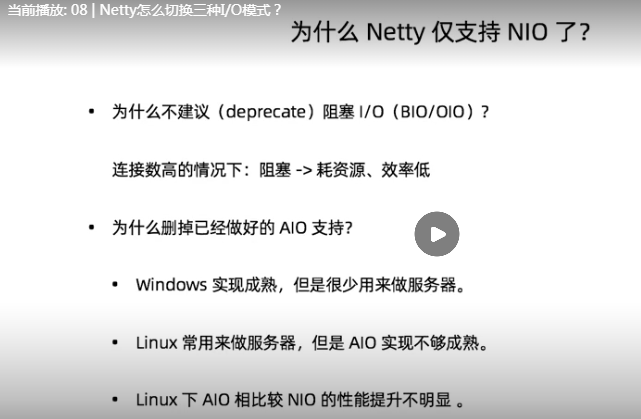

### 04.为什么舍近求远:不直接使用NIO

**netty做的更多**:

1. 支持常用协议

2. 解决传输问题: 粘包、半包现象

3. 支持流量整形

4. 完善的断联、idle等异常处理

**做得更好**

- 规避JDK NIO bug

> 经典的epoll bug : 异常唤醒空转导致CPU 100%
>
> 解决思路:
>
> 判断一定的空转阀值，如果达到了,重新rebuild多路复用器

- 如果设置的ip_ops参数，则直接不支持

### Reactor模式

